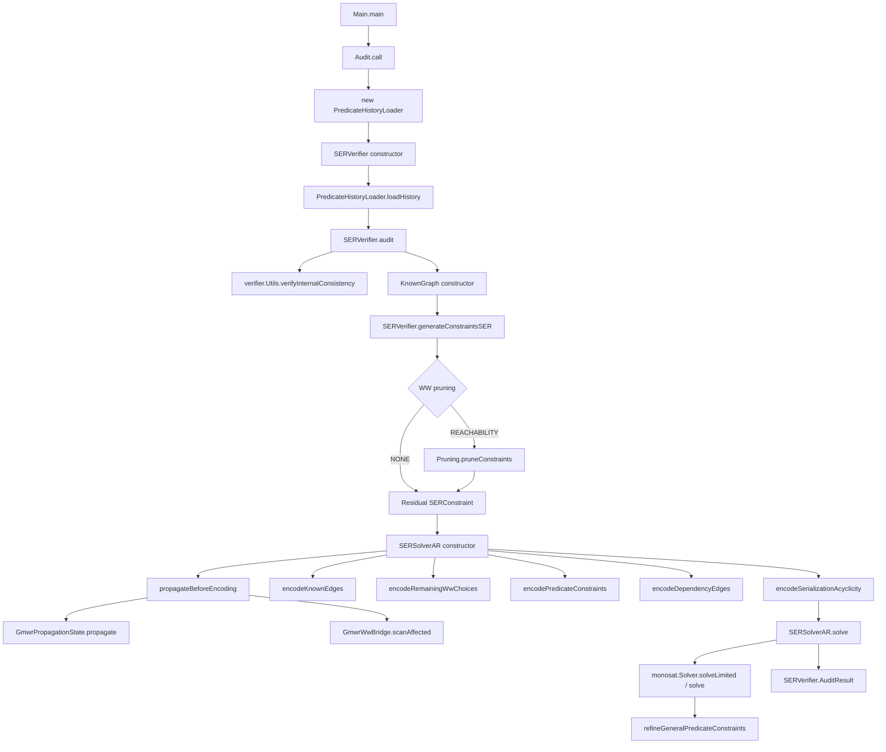
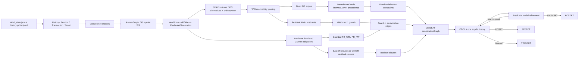
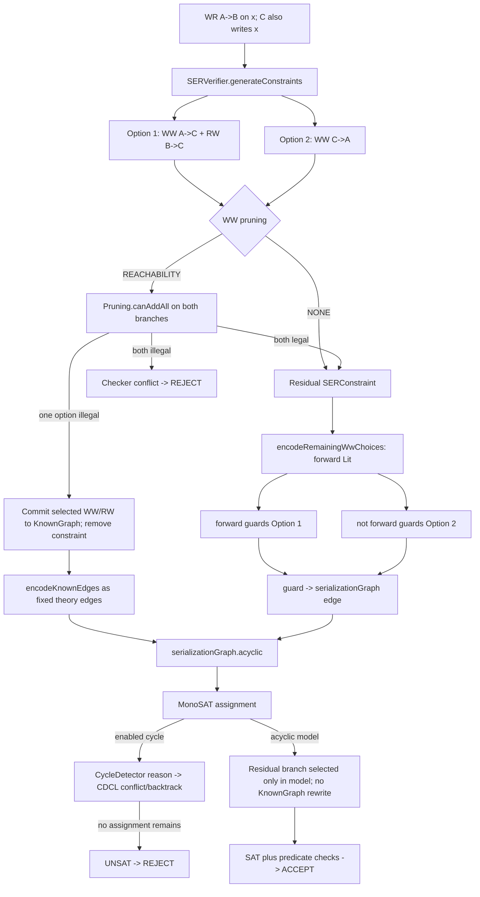
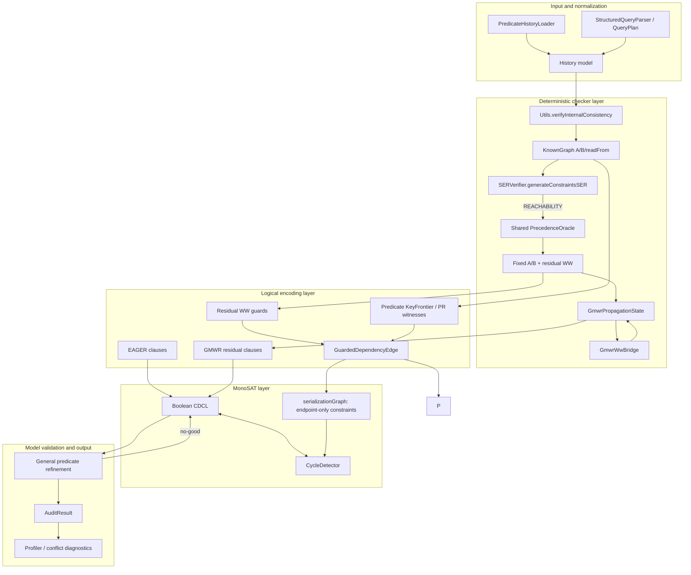

# SER 检测器整体处理流程设计文档

## 1. 文档范围与审计结论

本文描述 `SER/ser-result-detector` **当前工作树中的真实实现**，依据代码入口、调用链、数据结构、MonoSAT Java/JNI/C++ 路径以及当前测试生成，不以论文或旧文档补全代码中不存在的步骤。

结论先行：当前 checker 的主链是“PRHIST 解析 → History 内部一致性门禁 → logical dependency layer（`SO/WR/WW/RW/PR_WR/PR_RW` 元数据）→ 唯一 `serializationGraph` + Boolean clauses → MonoSAT/CDCL 与图无环理论联合求解 → general predicate model refinement → verdict”。

有五个必须先澄清的实现事实：

1. predicate dependency 不在初始 `KnownGraph` 构造阶段统一生成；主路径中的 `PR_WR/PR_RW` 主要在 `SERSolverAR.encodePredicateConstraints()` 内生成。
2. WW option 不由 Java 图在求解时“选边”。未被 pruning 决定的 option 用 SAT literal 表示；相应 MonoSAT edge 在 solve 前已创建，assignment 只决定是否启用。
3. 当前实现没有调用 MonoSAT reachability predicate。`SERVerifier`为一次audit创建唯一 `PrecedenceOracle<Transaction>`，通过constructor injection传给所有确定性order推理组件；MonoSAT侧只建立 `serializationGraph.acyclic()`，decision variables不进入oracle。
4. `SAT -> ACCEPT` 表示存在一个满足所有已编码约束的 assignment。代码不会在 SAT 后把选中的完整事务序或 dependency 重新写回 `KnownGraph`，也不输出完整 model。
5. 生产 CLI 默认运行完整 G2，只公开 `--predicate-encoding`、solver timeout 和 stats；WW pruning、GMWR propagation 细分及物理压缩开关仅作为隐藏实验兼容入口。

审计日期：2026-09-10。第一步代码索引见 `SER_CODE_MAP.md`。

## 2. 实际总流程，以及与题设概念流程的差异

实际调用顺序如下：

```text
Main.main
  -> Audit.call
     -> PredicateHistoryLoader
     -> new SERVerifier(...)       // 构造器中立即 loadHistory
     -> SERVerifier.audit
        -> verifyInternalConsistency
        -> new KnownGraph          // 此处 ensureInitialVersions
        -> generateConstraintsSER  // ordinary WW/RW
        -> WW reachability pruning (default; experimental NONE)
        -> new SERSolverAR
           -> create Solver + serializationGraph
           -> compact GMWR obligation build/preprop/full WW fixpoint（默认 G2）
           -> buildKnownOrder
           -> encode known edges
           -> encode residual WW choices
           -> encode residual predicate constraints (默认 GMWR；可选 EAGER/general)
           -> map guarded logical dependencies to serialization edges
           -> assert serializationGraph acyclic
        -> solve
           -> SAT? evaluate general predicate snapshots
           -> mismatch? add no-good and solve again
           -> SAT / UNSAT / TIMEOUT
        -> ACCEPT / REJECT / TIMEOUT
```

`audit HISTORY` 映射为 `GMWR + WW_GMWR + gmwrPrepropagation + predicateWitnessCoalescing + graphEdgeInterning`。公开的 `--predicate-encoding=eager` 映射为 E2：保留 WW reachability 和 graph edge interning，不构造 GMWR propagation state。

与题设给出的抽象流程相比，代码有以下顺序差异：

- `SERVerifier` 构造器先加载 history，`audit()` 才开始一致性验证；load error 不经过 `audit()` 的 verdict switch。
- “Normalize”不是独立阶段。值/query normalization 在 loader 中完成，缺失初始版本则延迟到 `KnownGraph` 构造器的 `History.ensureInitialVersions()`。
- ordinary WW/RW candidate 先生成并做 baseline pruning；predicate candidate 之后才在 solver 构造期生成。
- GMWR logical obligation 在 `SERSolverAR.propagateBeforeEncoding()` 中构造，发生在 `encodeKnownEdges()` 之前，但发生在 baseline pruning 之后。
- general query 不是一次性完全 CNF 化；它在第一次 SAT model 后进入“执行 query—加 no-good—重求解”的 refinement loop。
- 代码没有一个统一的 `Option` 或 `Group` 层。ordinary 二选一由 `SERConstraint.edges1/edges2` 表示；GMWR disjunction 由 `GmwrObligation/GmwrItem` 表示；predicate frontier 则由 `KeyFrontier` 表示。

## 3. 三层概念边界

必须区分下列三层：

```text
真实 history 语义中的 dependency
    != checker 中的逻辑/物化 edge
    != SAT/MonoSAT 中控制该关系的 literal
```

| 层 | 当前代码中的载体 | 含义 |
| --- | --- | --- |
| History 事实/语义 | `Event`、`PredResult`、`RecordedQueryResult`、session event order | 输入记录了什么读、写、query result；它本身不是一张依赖图。 |
| Checker 逻辑关系 | `SEREdge(from,to,type,keys)`、`SERConstraint`、`BadWriterObligation` | “若某 option/guard 成立，则需要这个 typed dependency/order”的候选命题。 |
| Checker 物化图 | Guava `KnownGraph.readFrom/knownGraphA/knownGraphB` 中的 `graph.Edge(type,key)` | Java 侧已确定的 transaction endpoint 和 relation type；只保存 fixed/forced 部分。 |
| SAT guard | fresh `Lit`、其否定、`Logic.and/or/not/xor` 的结果 | WW branch、selection、repair 等逻辑条件。plain guard 不等于 graph edge。 |
| MonoSAT serialization edge literal | `serializationGraph.addEdge()` 返回的 `Lit` | 某条物理串行化约束是否启用；物理图不保存 relation type，type/key 留在 `SEREdge` 与 `logicalDependenciesByEndpoint`。 |

`monosat.Graph.addEdge(from,to)` 的名字容易误解：它不是无条件插入一条边，而是创建一条由返回 literal 控制的 theory edge。只有该 literal 被 assert 或由 implication 推成 true 时，这条边才进入 MonoSAT under-approximation graph。

另一个关键边界是：

```text
semantic guard -> serializationGraph edge literal
```

`SERSolverAR.encodeDependencyEdge()` 建的是上述单向 implication，不是 biconditional。一个 physical serialization edge literal 为 true，不反推某个具体 WW/PR witness guard 为 true；开启 interning 时，多种 relation 可共享同一 endpoint physical edge。

## 4. 分阶段设计

### 4.1 History Input 与 Parse

| 审计项 | 当前实现 |
| --- | --- |
| 1. 输入 | CLI positional `path`；可指向 history 目录或 `history.prhist.jsonl`。同目录必须有 `initial_state.json`。 |
| 2. 输出 | `History<String, PredicateHistoryLoader.PredicateValue>`。 |
| 3. 核心结构 | Jackson `JsonNode`；`History`、`Session`、`Transaction`、`Event`、`Event.PredResult`、`RecordedQueryResult`、`QueryPlan`。 |
| 4. 代码 | `Main.Audit.runAudit()` 直接构造 `PredicateHistoryLoader`；后者执行 `loadHistory/loadInitialState/parseTransaction/parseOperation/parseQueryPredicateResult`；`StructuredQueryParser.parse()` 解析 query。 |
| 5. 信息变化 | JSON tuple/operation 被转换为 typed objects；初始状态进入 bottom transaction；query JSON 变成 AST；result inputs/values 变成 canonical recorded result。 |
| 6. 推导类型 | 完全确定性；格式或值不合法抛 `InvalidHistoryError`/`Error`。 |
| 7. graph edge | 不产生。 |
| 8. literal/constraint | 不产生。 |
| 9. 下一阶段消费 | `SERVerifier` 保存 history；`verifyInternalConsistency()` 和 `KnownGraph` 遍历它。 |
| 10. 复杂度 | JSON解析与暂存为输入大小线性量级；`N`个事务排序为O(N log N)；query AST/value canonicalization 与对应 JSON 节点大小线性相关。 |

输入契约的代码事实：

- `audit` 直接使用 `PredicateHistoryLoader`，不再维护单值 history type 工厂。
- transaction 只接受 `status=commit`。
- loader先显式读取每个transaction的 `session`、`session_seq`、`txn`，要求`session_seq`是可表示为`long`的整数，并拒绝同一session内重复的`session_seq`；全部header验证后按`(session, session_seq)`排序，再解析`ops`并构造session transaction list。JSONL行顺序不再决定SO。
- operation 只接受 `w`、`r`、`pr`；`pr` 必须是 `query` + `result`，旧字段 `predicate/results` 被拒绝。
- value 不允许 null、array、非整数 number；object/string/boolean/integer 等由 `QueryValue` canonicalize。
- 当前 loader 显式拒绝 `write_id`、`source_write_id`、`source_txn`、`source_op_index`。因此 point/predicate source 实际依赖唯一 `(key,value)`，不是 metadata。

### 4.2 Normalize、内部表示与一致性门禁

| 审计项 | 当前实现 |
| --- | --- |
| 1. 输入 | loader 生成的 `History`。 |
| 2. 输出 | 通过门禁的同一 history；失败则 `audit()` 立即 `REJECT`。缺失 bottom version 稍后由 `KnownGraph` 触发补全。 |
| 3. 核心结构 | `(key,value)->List<WriteRef>`、`(txn,key)->write positions`、`PredicateReadState`；history 的有序 event/session lists。 |
| 4. 代码 | `verifier.Utils.verifyInternalConsistency/checkItemRead/checkPredicateRead/predicateSnapshotMatches`；`History.ensureInitialVersions()`。 |
| 5. 信息变化 | consistency 方法只建临时索引并验证；`ensureInitialVersions()` 会在 bottom transaction 追加 `value=null` 的 ABSENT write。 |
| 6. 推导类型 | 确定性。 |
| 7. graph edge | 不产生。 |
| 8. literal/constraint | 不产生。 |
| 9. 下一阶段消费 | `KnownGraph` 消费已验证并补全初始版本的 transaction/event。 |
| 10. 复杂度 | 建索引 O(E)；point source lookup 均摊 O(1)，transaction 内位置检查 O(log W_txn,key)；每个 predicate read 扫描已知 key/value 集，约 O(PK)，完整 query evaluation 的成本由 query plan/result cardinality 决定，join 可高于线性。 |

点读门禁要求：source 唯一；self read 使用本事务该 key 的最新先前 write；external read 使用 writer transaction 对该 key 的最终 write，且 reader 在读前没有自己的该 key write。

predicate 门禁要求：result key 唯一；每个输入能解析到唯一 committed source；key 在 query scope；external source 是 writer txn 的最终 write；internal source 是 reader txn 在 query 前最新 write；recorded inputs 与 `PredResult` 一致。row-local 重复同谓词读还要继承未被 self write 改变的 key；general query 只有在所有 covered keys 都是 local 时才在这里完整执行，否则延迟给 solver。

`ensureInitialVersions()` 的 key universe 来自 point read/write 和 predicate result 中实际出现的 key；对于只存在于抽象关系域但在 history 中从未出现的 key，代码没有外部 catalog 可以枚举。当前 checker因此是 history 内有限 key universe。

### 4.3 Initial Dependency Extraction 与 KnownGraph

| 审计项 | 当前实现 |
| --- | --- |
| 1. 输入 | consistency 通过的 `History`。 |
| 2. 输出 | `KnownGraph`：transaction nodes、SO、point WR、write indexes、predicate observations。 |
| 3. 核心结构 | `readFrom`、`knownGraphA`、`knownGraphB`、`allWrites`、`writesByKeyValue`、`txnWrites`、`PredicateObservation`。 |
| 4. 代码 | `KnownGraph` constructor；`resolveUniqueSource()`；`putEdge()`。 |
| 5. 信息变化 | 相邻 session transaction 形成 SO；point source writer->reader 形成 WR；predicate result只解析 tuple source和 internal/external 分类，不在主路径立即形成 PR edge。 |
| 6. 推导类型 | 确定性。 |
| 7. graph edge | SO、WR 进入 Guava graph；WR 同时进入 `readFrom` 和 A。B 初始通常为空。 |
| 8. literal/constraint | 不产生 SAT literal。 |
| 9. 下一阶段消费 | `generateConstraintsSER()` 读取 `readFrom/all writes`；pruning 读取 A+B；solver读取全部 indexes/observations。 |
| 10. 复杂度 | 节点/写/点读 O(T+W+R)；每个 predicate observation 扫有限 key universe，O(PK)；BitSet 分类空间约 O(PK/word)，图空间 O(T+E_fixed)。 |

`KnownGraph` 的分区为：

```text
readFrom   = WR only
knownGraphA = SO, WR, WW, PR_WR
knownGraphB = RW, PR_RW
```

SO 只加入 session 内相邻 transaction；传递顺序由后续 closure/acyclicity保证，不重复存全部 SO closure。

`PredicateObservation` 对 scope 中每个已知 key 分类：本 transaction 在本次 predicate read 前写过，或此前同 identity predicate 已覆盖且中间没有破坏继承条件的 key，被标为 internal；其余为 external。分类使用 covered/internal BitSet 的 default+exceptions 压缩，并保存 `coverageEpoch`。

### 4.4 Ordinary WW/RW Constraint Candidate Generation

| 审计项 | 当前实现 |
| --- | --- |
| 1. 输入 | `History` writes 与 `KnownGraph.readFrom` WR。 |
| 2. 输出 | `Collection<SERConstraint>`，每项是 `edges1 OR edges2`。 |
| 3. 核心结构 | `SERConstraint`、`SEREdge`、writer pair map。代码中没有独立 `Option`/`Group` class。 |
| 4. 代码 | `SERVerifier.generateConstraintsSER()` -> `generateConstraintsCoalesce()`。 |
| 5. 信息变化 | 为同 key 的不同 writer transaction 建双向 WW alternative；把 `WR(A,B,k)` 与候选 `WW(A,C,k)` 推出的 `RW(B,C,k)` 放入同一 branch。 |
| 6. 推导类型 | candidate 集合确定性；选择尚未决定。集合/HashMap 迭代可能影响 id/编码顺序，但不应影响可满足性。 |
| 7. graph edge | 此时只产生 `SEREdge`，不进入 Guava `KnownGraph`。 |
| 8. literal/constraint | 产生 checker disjunction，不产生 MonoSAT literal。 |
| 9. 下一阶段消费 | baseline pruning 先尝试消除 option；残余交 `SERSolverAR.encodeRemainingWwChoices()`。 |
| 10. 复杂度 | WW writer pair O(Σ_k w_k²)；RW 扩展 O(Σ_k WR_k·w_k)；内存与生成的 branch edge 总数同阶。 |

同一 transaction writer pair 在多个 key 上的 WW 和相应 RW 始终汇入同一个 `SERConstraint`，因为一个全局 serialization order 只能给该 transaction pair 一个方向。旧非合并生产分支已删除。

### 4.5 Baseline Pruning

| 审计项 | 当前实现 |
| --- | --- |
| 1. 输入 | A+B fixed graph 与 ordinary `SERConstraint` 集合。 |
| 2. 输出 | 增强后的 `KnownGraph`、删除已决定项后的 residual constraints；或 checker conflict。 |
| 3. 核心结构 | audit-scoped唯一 `PrecedenceOracle<Transaction>`。 |
| 4. 代码 | `SERVerifier.audit()` WW pruning switch；`Pruning.pruneConstraints()`。 |
| 5. 信息变化 | `REACHABILITY`试加branch检查环；被决定branch的WW/RW写入A/B并从residual删除。 |
| 6. 推导类型 | checker 确定性传播，无 SAT decision。 |
| 7. graph edge | forced branch 的 WW进入 A，RW进入 B。 |
| 8. literal/constraint | 不产生 SAT literal/clause。 |
| 9. 下一阶段消费 | GMWR overlay和 `buildKnownOrder()`读取增强后的 A+B；residual constraint 变成 SAT WW choices。 |
| 10. 复杂度 | BitSet closure 空间 O(T²/word)，初始化约 O(T³/word)；每个 forced incremental edge最坏 O(T²/word)；多轮扫描还包含 residual constraint 和 `observation × same-key writers`。 |

默认 `REACHABILITY` 的具体链路是：

```text
non-predicate fixed A+B edges
  -> PrecedenceOracle
  -> branch wouldCycle
  -> illegal option elimination
  -> one legal option => forced
  -> branch WW/RW materialize to KnownGraph
  -> incremental reachability propagation
  -> next round
```

单边和多边 branch 都调用同一 oracle；批量 `wouldCycle` 在 oracle 内部构造只含相关 endpoint 的局部试探闭包。停止条件是无 residual、发生冲突，或本轮解决数不超过剩余数的 `stopThreshold=1%`。

### 4.6 GMWR Pre-propagation 与 WW Feedback

此阶段只在 `predicateSolvingMode=GMWR` 构造，但 obligation 构造不受 `gmwrPrepropagation` 开关控制。

| 审计项 | 当前实现 |
| --- | --- |
| 1. 输入 | baseline-pruned A+B、residual WW constraints、predicate observations和 writes。 |
| 2. 输出 | `PrecedenceOracle` 中的确定顺序、GMWR obligations/frontier domains、definite typed/order facts；可进一步减少 residual WW或产生冲突。 |
| 3. 核心结构 | 从 `SERVerifier`注入的同一 `PrecedenceOracle`、`GmwrObligation(reader,badWriter)`、`GmwrItem(repairs)`、`FrontierDomain`、`DependencyFact`、work queue。 |
| 4. 代码 | `SERSolverAR.propagateBeforeEncoding/collectGmwrLogicalConstraints/propagateGmwrToWwFixpoint`；`GmwrPropagationState`；`GmwrWwBridge`。 |
| 5. 信息变化 | 移除会成环的 repair/source；识别已满足 obligation；强制 `reader<bad`、singleton repair chain、唯一 PR_WR；`WW_GMWR` 还可强制 WW/RW branch并写回 KnownGraph。 |
| 6. 推导类型 | checker 确定性 propagation；没有 SAT decision。 |
| 7. graph edge | feedback branch写 Guava WW/RW；typed definite fact保留 logical metadata并稍后进入 serialization graph；derived order也只进入 serialization graph。 |
| 8. literal/constraint | 此阶段本身不创建 SAT literal。未决定 obligation稍后才转为 clauses。 |
| 9. 下一阶段消费 | `buildKnownOrder/encodeKnownEdges`消费 definite facts；`resolveAndEncodeGmwrBundles()`消费 residual obligations。 |
| 10. 复杂度 | reachability O(T²/word) 空间；每个新 definite fact增量 closure最坏 O(T²/word)；repair/frontier work量与 item/candidate 数相关；WW feedback按轮扫描受影响或全部 residual constraints。 |

GMWR item 的逻辑形态为：

```text
reader < badWriter
OR
存在 repair: badWriter < repair < reader
```

相同 `(reader,badWriter)` 的不同 key obligation被 bundle，但 items 是 AND，不因 bundle 合并而丢掉某个 key；repair set按包含关系保留最强的 antichain item。

`serPropagationMode` 的当前真实分支只有：

- `WW_GMWR`：在 preprop 后运行 GMWR→WW feedback fixpoint。
- `WW_ONLY` 与 `WW_GMWR_ONEWAY`：都不运行 feedback。若其余 settings 相同，两者在 `SERSolverAR` 中没有其他行为差异。

### 4.7 Constraint Encoding：共享核心、EAGER 与 GMWR

| 审计项 | 当前实现 |
| --- | --- |
| 1. 输入 | fixed A+B、GMWR definite facts、residual WW constraints、predicate observations、write indexes。 |
| 2. 输出 | SAT Boolean formula；logical dependency metadata；`serializationGraph` 的 conditional/fixed theory edges；一个 `acyclic` assertion；general query refinement records。 |
| 3. 核心结构 | `serializationEdgeCache/comparablePairs/wwOrder`、`GuardedDependencyEdge`、`logicalDependenciesByEndpoint`、predicate candidates、`KeyFrontier`、`PredicateCheck`、一张 `monosat.Graph`。 |
| 4. 代码 | `SERSolverAR` constructor 中 `encodeKnownEdges/encodeRemainingWwChoices/encodePredicateConstraints/encodeDependencyEdges/encodeSerializationAcyclicity`。 |
| 5. 信息变化 | checker candidates转成 guards、clauses、implications和 physical theory edges；predicate witnesses可合并；known/forced facts assert true。 |
| 6. 推导类型 | fixed/constant simplification确定；residual WW、frontier、GMWR repair由 SAT decision。 |
| 7. graph edge | 非 bottom/self logical dependency与需要比较的 order 都映射为 `serializationGraph` edge；known edge和forced facts assert启用。 |
| 8. literal/constraint | fresh WW guard、serialization edge literals、XOR、AND/OR、implications、GMWR/eager/no-good clauses、acyclic literal。 |
| 9. 下一阶段消费 | MonoSAT CDCL分配 Boolean；graph theory根据 edge literals检查唯一 serialization graph；general refinement读取 model。 |
| 10. 复杂度 | known-order closure约 O(T³/word)；ordinary encoding与 branch edge、WR×writer数量线性；predicate frontier/selection/PR_RW最坏 O(PΣw_k²)；SAT最坏指数；general refinement组合数最坏为各 key frontier大小乘积。 |

#### 4.7.1 Fixed known edge encoding

`buildKnownOrder()`把 A+B 的所有 edge type 合并为 transaction precedence，计算 closure、检测 cycle并生成 transitive reduction。`isEncodedKnownEdge()` 当前无条件返回 true。

`encodeKnownEdges()`执行两件事：

- A+B 中每一条 typed known edge保留为 logical metadata，guard=`Lit.True`。
- logical dependency 的端点方向和 known-order transitive reduction 都进入 `serializationGraph`。

bottom transaction不建 MonoSAT node。`bottom<real`由 `orderLiteral/wwOrderLiteral` 返回 `Lit.True`，`real<bottom`返回 `Lit.False`；bottom/self dependency不物化为 physical graph edge。

#### 4.7.2 Residual WW choice

每个 residual `SERConstraint c`：

```text
forward = new Lit(solver)
backward = not(forward)

forward  -> c.edges1 中每条 dependency/order edge
backward -> c.edges2 中每条 dependency/order edge
```

由于两个 guard互为正负，不需要额外 exactly-one clause。branch内的 WW和由该 WW推出的 RW共用 guard。

#### 4.7.3 Predicate witness coalescing 与 physical merge

三个独立压缩开关/层不能混淆：

| 压缩 | 实现 | 删除/复用什么 | 是否改变语义条件 |
| --- | --- | --- | --- |
| WW constraint coalescing | `generateConstraintsCoalesce()` | 同 transaction pair跨 key共用一个 branch choice | 目标是保留全局 transaction order语义。 |
| Predicate witness coalescing | `prunePredicateDependencies()` | 相同 `(from,to,type)` 的逐 key PR witness合为一个 `SEREdge(keys)`，guard取 OR | physical typed edge只需在任一 witness成立时启用。 |
| Graph-edge interning / physical merge | `encodeDependencyEdge()` / `directSerializationEdge()` | 相同 `(from,to)` 的 relation type/key可共享一个 `serializationGraph` edge literal | 只压 endpoint physical edge；logical metadata仍被记录。 |

后两项适用于 EAGER 和 GMWR，不是 GMWR 专属优化。

### 4.8 MonoSAT Solve、Predicate Refinement 与 Verdict

| 审计项 | 当前实现 |
| --- | --- |
| 1. 输入 | 完成编码的 `monosat.Solver`，以及带稳定 `A<n>` id 的 assumption literals。 |
| 2. 输出 | `SolveStatus.SAT/UNSAT/TIMEOUT`，再映射 `AuditResult`。 |
| 3. 核心结构 | MonoSAT CDCL state、graph under/over approximation、`PredicateCheck` model snapshots、`assumption literal -> logical reason` 映射。 |
| 4. 代码 | `SERSolverAR.solve/solveOnce/refineGeneralPredicateConstraints`；MonoSAT `Graph.addEdge/acyclic`、`GraphTheorySolver.newEdge/acyclic`、`CycleDetector.propagate/buildDirectedCycleReason`；`SERVerifier.audit()`。 |
| 5. 信息变化 | CDCL assignment启用/禁用 theory edges；cycle产生 learned conflict；general query mismatch追加 no-good clause；不修改 Java `KnownGraph` model。 |
| 6. 推导类型 | SAT decision + BCP + MonoSAT graph theory propagation；query refinement是 checker对model的确定性验证。 |
| 7. graph edge | solve期间不创建新 serialization edge；只改变预建 edge literal assignment。refinement可能请求已有 serialization literal组成新 clause。 |
| 8. literal/constraint | residual WW choice、predicate obligation、GMWR rule各有assumption id；predicate no-good沿用其observation assumption；theory conflict reason和learned clauses不断加入/传播。 |
| 9. 下一阶段消费 | 无新 no-good 的 SAT -> ACCEPT；UNSAT/提前冲突 -> REJECT；backend无结果 -> TIMEOUT。 |
| 10. 复杂度 | CDCL最坏指数；cycle detection/reason成本取决于 MonoSAT内部动态图算法和cycle长度；general refinement最坏可能枚举指数个frontier组合并重复solve。 |

`solve()` 的循环：

```text
solveOnce
  -> solve(assumptions)
  -> UNSAT: getConflictClause -> assumption id -> logical reason
  -> TIMEOUT: TIMEOUT
  -> SAT:
       refinePredicateConstraints
         -> 无 mismatch: SAT
         -> 有 mismatch: add no-good -> solveOnce again
```

## 5. 各关系的来源、物化与 literal

下表中的“直接物化 graph edge”专指 Java `KnownGraph`；MonoSAT physical edge另列。代码名使用 `PR_WR/PR_RW`，对应题目中的 Pred-WR/Pred-RW。

| Relation | 来源 | 是否固定 | 是否直接物化 graph edge | 是否有 SAT literal | 何时产生 | 何时传播 |
| --- | --- | --- | --- | --- | --- | --- |
| SO | 同 session 相邻 transaction 的输入顺序 | 是 | 是，A | 无独立选择 literal；对应 serialization edge assert true | `KnownGraph` constructor | `PrecedenceOracle`、MonoSAT serialization acyclicity |
| WR | point read按唯一 `(key,value)`解析到 source writer | 是 | 是，`readFrom` + A | 无独立选择 literal；对应 serialization edge assert true | `KnownGraph` constructor | 生成 ordinary RW；Java closure；MonoSAT serialization cycle |
| WW | 同 key 的不同 writer transaction 必须定向 | pruning前否；forced后是 | forced option写入 A；residual 不写入 | residual constraint每项一个 forward guard；对应 serialization edge literal | `generateConstraints*()`；forced时 `Pruning/GmwrWwBridge`；residual在 `encodeRemainingWwChoices()` | checker option propagation；SAT BCP；MonoSAT cycle theory |
| RW | `WR(A,B,k)` 且 `WW(A,C,k)`推出 `B->C` | 随 WW option；forced branch时固定 | forced option写入 B；SAT option不回写 | 与 WW branch 共用 guard；对应 serialization edge literal | constraint generation；residual 分支在 `encodeRemainingWwChoices()` 中激活 | WW guard true时 BCP强制 serialization edge；cycle反馈冲突 |
| Pred-WR / PR_WR | predicate latest-visible source writer到 reader；recorded input或候选 frontier | recorded/唯一 source可固定；候选 source不固定 | 部分：`addKnownPredicateEdge()`加入 A；GMWR typed definite fact不一定先写 Guava图；候选不写 | selection guard + serialization edge literal | GMWR seed/preprop或 `encodePredicateConstraints/createKeyFrontier` | checker GMWR propagation、SAT selection/implication、MonoSAT cycle |
| Pred-RW / PR_RW | selected predicate source之后的 result-changing writer：reader到later writer | 通常条件式；guard可化为常量 true | 主求解路径通常不写 B；诊断派生路径会写 B | `latestValidity(source) AND source<later` + serialization edge literal | `LatestVisibleChecker/assertLatestVisible/encodeSelectedPredicateDependencies` | SAT BCP和MonoSAT cycle；不在 baseline pruning中传播 |

补充：MonoSAT `serializationGraph` 只有 endpoint，无 A/B/type标签。SO、WR、WW、RW、PR_WR、PR_RW 的区别保留在 logical dependency layer，用于产生 guard、explanation、debugging 和 paper description；cycle theory只看启用的有向 endpoint edges。

## 6. WW / WR / RW 逻辑关系专项审计

设点读关系为：

```text
WR(A, B, x)    // B 读到 A 对 x 的写
C also writes x
```

代码生成的核心二选一为：

```text
Option 1: WW(A, C, x) AND RW(B, C, x)
Option 2: WW(C, A, x)
```

其中 RW 不是独立猜测：只有选择 A 在 C 前时，B 才必须在 C 前。`generateConstraintsCoalesce()` 把 RW 放进对应 WW decision branch，`encodeRemainingWwChoices()` 用同一 guard 同时激活 WW 与 RW。求解器不再从 `readFrom × writesByKey` 独立重建 ordinary RW。

### 6.1 WW option 在哪里选择

- checker 外部 Java graph只保存 fixed/forced choice。
- residual choice在 MonoSAT所属的 SAT core中用 `new Lit(solver)`选择。
- forward=true 选择 `edges1`；forward=false等价于 backward=true，选择 `edges2`。

因此答案是：**未剪枝的 WW option在 SAT 中选择，不在 `KnownGraph` 中选择。**

### 6.2 选择后 RW 是否创建新 graph edge

需要按三种“edge”回答：

| 所指对象 | 行为 |
| --- | --- |
| Java `KnownGraph` edge | checker pruning决定 option时会立即写 RW 到 B；SAT assignment决定 residual option时不会在 solve 后回写新 RW。 |
| `SEREdge` logical candidate | solve 前由 WW/RW branch generation 创建。 |
| MonoSAT serialization edge | solve 前由 `encodeDependencyEdges()`预先创建 conditional physical edge；WW guard=true后，implication强制其 edge literal=true，因而在唯一 theory graph中启用。不是 assignment 后动态调用 `addEdge()`。 |

对于 ordinary RW 的非 bottom、非 self endpoint，代码为其建立 serialization constraint。bottom/self不建物理边；其顺序语义由 bottom常量、self=false和 contradiction处理。

### 6.3 如果没有显式 typed edge，顺序如何保证

`encodeDependencyEdge()`先得到 serialization target：

```text
guard -> serialization(from,to)
```

对 bottom/self 端点，非法/必然顺序由常量直接处理；对真实事务端点，依赖投影到 `serializationGraph`。

GMWR residual obligation是另一种情况：它有意只编码 order clause：

```text
R<B OR (B<G1 AND G1<R) OR ...
```

该 obligation本身没有一个名为“GMWR edge”的 typed dependency；PR_WR/PR_RW由 source-aware frontier路径另行生成。

### 6.4 literal=true 究竟触发什么

- WW `forward=true`：同一 branch全部 `SEREdge` guard变真。
- `guard=true` 经 BCP：必须令对应 `serializationGraphEdge=true`。
- `serializationGraphEdge=true`：该 endpoint 约束进入唯一 graph under-approximation。
- serialization graph 出现 enabled cycle：`CycleDetector`生成由 cycle edge literals 组成的 conflict reason，交回 CDCL 回溯/学习。

### 6.5 是否双向绑定

有两个不同答案：

- physical MonoSAT edge与 `Graph.addEdge()`返回的 theory literal是同一控制对象，literal=true定义为 edge enabled。
- semantic WW/RW/PR guard与 physical edge **不是双向绑定**。代码只有 `guard -> edgeLit`，没有 `edgeLit -> guard`。开启 endpoint interning时，一个 edgeLit还可被多个 relation guard共享。

额外 edge literal可被 solver临时猜为 true并触发cycle conflict，但由于没有必须为真的反向约束，solver可把它设为false。当前代码意图是保持可满足性；然而该单向映射使model中的 physical edge集合不能被当作精确的 semantic dependency集合。

## 7. Predicate / SER 扩展

### 7.1 Predicate read 的内部表示

```text
PRHIST pr operation
  -> QueryPlan(root AST, projected columns, distinct, QueryScope)
  -> Event(PREDICATE_READ, predicate, PredResults, RecordedQueryResult)
  -> KnownGraph.PredicateObservation
       reader txn
       event index
       tupleSources(key,value,WriteRef)
       covered keys
       internal/external classification
       coverage epoch
```

`QueryPlan.evaluate(VisibleState)`返回：

- `values`：投影结果行；
- `inputs`：产生这些结果的物理 key/value 行；
- `valueMultiset`：保留 bag semantics；
- `canonicalInputs`：canonical value后的 input map。

row-local且投影形状正好是 `(k,value)` 时，`RowLocalRecordedQueryResult`不重复保存完整投影值，只保存 inputs、plan和“记录值能否由 inputs推导”的布尔结果。JOIN、DISTINCT和其他 general query使用 `GeneralRecordedQueryResult`保留完整值多重集和 canonical inputs。

代码中没有 `Vset` 名称。若将题目中的 Vset理解为“谓词读观察到的版本集合”，最接近的真实载体是 `result.inputs`、`Event.PredResult`、`RecordedQueryResult.inputs()`和解析后的 `tupleSources`；不能在本文中虚构一个 Vset对象。

### 7.2 Pred-WR 的确定

1. 每个 recorded result input按唯一 `(key,value)`解析到 `WriteRef`。
2. internal key由本 transaction最新 self write或前一同谓词read继承决定，不建立跨事务 PR_WR。
3. external recorded source必须能成为 reader前的 latest-visible writer；EAGER 与 GMWR 都使用 `LatestVisibleChecker` 返回的 validity，EAGER 直接传完整候选，GMWR 先做安全候选缩减。
4. sourceless/absent key允许“不存在可见 source”；若选择一个产生空 contribution 的 good writer作为 frontier，则产生 guarded PR_WR。

`LatestVisibleChecker.check(reader,key,candidates,serializationOrder)` 对每个 source 返回的 latest-writer validity 是：

```text
source.visible
AND 对所有 other:
    NOT(other.visible AND source<other)
```

其中 `writer.visible = writer<reader`，写间比较优先用 key-local `wwOrderLiteral`。

### 7.3 Pred-RW 的形成

给定 selected source S 和同 key later writer U：

```text
selected(S)
AND beforeWrite(S,U)
AND writeChangesPredicateResult(S,U)
    -> PR_RW(reader,U,key)
```

`writeChangesPredicateResult()`不是只比较 predicate true/false。若两写都匹配，非 compact row-local会比较完整 `RowContribution` 的值多重集和 canonical inputs；compact路径最终也用 key/value差异。这样可覆盖“仍匹配但结果版本/值改变”的情况。

### 7.4 与普通 key-value WR/RW 的差别

| 方面 | Point WR/RW | Predicate PR_WR/PR_RW |
| --- | --- | --- |
| source | read的 `(key,value)`唯一确定 | recorded input可确定；absent/general key可能由 frontier/order决定 |
| 初始图 | WR直接进 `readFrom+A` | 初始 `KnownGraph`只存 observation，主PR edge在solver内产生 |
| anti-dependency | 对每个第三 writer，随 WW机械产生 RW | 只有 source之后且改变predicate结果的 writer产生 PR_RW |
| snapshot | 单 key latest write | 多 key共同 visible snapshot；JOIN/DISTINCT需整体执行 query |
| SAT role | WW choice守卫 RW | visibility、latest selection、repair、query no-good共同守卫PR关系 |

### 7.5 与当前“原 PolySI 风格”核心的代码关系

当前仓库可直接确认的关系是：ordinary部分仍使用 `SERConstraint.edges1/edges2` 的两分支 writer-order constraint，代码注释称该 generation “unchanged from the original implementation”；predicate扩展没有改写这一核心，而是在其后增加：

- `PR_WR/PR_RW` 两个 `EdgeType`；
- `PredicateObservation`；
- 共享的 `serializationGraph` 和 frontier selection；
- EAGER/GMWR result-validity constraints；
- general query lazy refinement。

当前仓库根目录没有可供逐行对照的独立 `PolySI` 源码模块，因此本文不能从当前文件证明与某个外部/历史 PolySI commit 的完整同源或逐条等价，只能陈述上述当前代码结构关系。

### 7.6 SER predicate 扩展的规模

令某 predicate reader覆盖 key集合 K，key k有 `w_k` 个external final-write candidates：

- frontier visible/order literals：O(Σ_k w_k)，大多与 WW/order cache复用；
- selected-source guard构造：最坏 O(Σ_k w_k²)；
- PR_WR logical candidates：最坏 O(Σ_k w_k)；
- PR_RW logical candidates：最坏 O(Σ_k w_k²)；
- EAGER absent validity：每个 bad writer一条 clause，每条最多包含全部 good repair，最坏 O(Σ_k b_k g_k) terms；
- GMWR：同 `(reader,badWriter)` 的 item bundle/antichain压缩，预传播后只编码 residual items；上界仍可达 O(Σ_k b_k g_k)，但跨 key重复和被支配集合可被消掉；
- general query：初始 frontier规模同上，refinement轮数最坏受 `Π_k (w_k+absence)` 组合数约束。

physical edge数量还受两次合并影响：predicate coalescing后最多是唯一 `(from,to,type)` 数；graph interning后最多是唯一 `(from,to)` 数。

## 8. EAGER 与 GMWR 的真实编码比较

### 8.1 共同部分

两条路径共享：

- 同一 SO/WR/WW/RW ordinary core；
- 同一 `analyzeAbsentKey()` 对 good/bad writer及 result delta 的判断；
- 同一 key-local WW/order literals；
- source-aware PR_WR/PR_RW frontier机制；
- 同一张 serialization graph acyclicity；
- general query最终调用同一 `QueryPlan.evaluate()`和 canonical result comparison。

### 8.2 EAGER

对一个 external row-local absent key，设有 m个候选、b个 bad writer、g个空贡献 good writer：

```text
输入 observation + writes
  -> LatestVisibleChecker(完整 m 个候选)
  -> 返回每个候选的 visible + latest-valid literal
  -> 最多 m 个 guarded PR_WR
  -> 最多 O(m²) 个 guarded PR_RW candidate
  -> 对每个 bad B 立即加入一条：
       NOT(B<reader)
       OR OR_good((G<reader) AND (B<G))
  -> predicate witness coalescing
  -> guard -> serialization edge
  -> serializationGraph.acyclic
```

recorded source没有额外 WW choice variable；它形成 fixed PR_WR，并为每个 result-changing later writer建立 `beforeWrite(source,later)` 守卫的 PR_RW。

MonoSAT最终看到：ordinary residual WW guards及其 serialization implications、全部 eager row-local result-validity clauses、source-aware predicate serialization constraints、一张 graph acyclicity，以及 general query 可能产生的后续 no-good。typed predicate metadata 仍留在 logical layer。

### 8.3 GMWR

同一个 absent key：

```text
输入 observation + writes
  -> collectGmwrLogicalConstraints
       每个 bad B 产生 item:
       reader<B OR OR_good(B<G AND G<reader)
  -> 按(reader,B) bundle + repair antichain
  -> 可选 BitSet prepropagation
       删除不可能repair / force outside / force singleton / conflict
  -> 可选 WW feedback，提前决定ordinary WW branch
  -> 缩减不可能成为latest/source的候选
  -> LatestVisibleChecker(缩减后的候选)
       只有good writer可产生absent-key PR_WR
  -> source-aware PR_RW保持
  -> residual item才转为SAT clause
  -> predicate/physical edge合并
  -> serializationGraph.acyclic
```

GMWR没有为每个 bundle再创建一个专用 selector variable；residual clause直接复用 `orderLiteral(reader,bad)` 以及 `Logic.and(orderLiteral(bad,repair), orderLiteral(repair,reader))`。因此 exact literal数量取决于 constant folding、`serializationEdgeCache`和 `Logic.and/or`内部辅助变量，静态代码不能给出固定整数。可确认的是：每个未消除 item产生一条 clause，至多 `1 + repairCount` 个 clause terms；每个 repair conjunction可能需要一个 Boolean组合 literal。

MonoSAT最终看到：可能少于 EAGER 的 residual WW choice（只在 feedback 强制了 branch 时）、GMWR residual order clauses、更少的无效 bad-source predicate constraints，以及唯一 `serializationGraph.acyclic()`。已被 preprop 证明的 order 与 typed definite fact 都映射为 fixed serialization edge，typed fact 的元数据仍保留。

### 8.4 语义对应

对 row-local absent key，EAGER 每个 bad B 的 clause可化为：

```text
NOT(B<reader) OR (G<reader AND B<G) ...
== reader<B OR (B<G<reader) ...
```

这正是 GMWR item。bundle对同 `(reader,B)` 共享 outside term，但仍逐 item取 AND；repair antichain只删除被更强 clause蕴含的较弱 repair集合。因此**在当前 row-local obligation公式上，两者是不同编码结构、同一判定条件**。

recorded source和 typed predicate dependency的实现路径不同，但在当前 loader的唯一 `(key,value)`、完整 canonical input校验和 `writeChangesPredicateResult()` 条件下，二者都要求 recorded版本成为合法 latest-visible source。

### 8.5 Lemma：`SAT(EAGER) \iff SAT(GMWR)`

**适用范围。** 该引理比较同一 history、同一 ordinary constraints、同一 strict serialization order和同一组 row-local predicate obligations；`SAT(EAGER)`表示立即展开这些 obligations 后的可满足性，`SAT(GMWR)`表示经过 GMWR reduction、forced fact物化和 residual item编码后的可满足性。两侧共有的 SO/WR/WW/RW、typed predicate dependencies与 `serializationGraph.acyclic()`记为 `C`。

对 reader `R`、bad writer `B` 和一个 good-repair集合 `S`，定义：

$$
O(R,B,S) \equiv (R < B) \lor \bigvee_{G\in S}(B < G \land G < R).
$$

同一 `(R,B)` bundle中的各 key/item 是合取：

$$
\Phi_{R,B} \equiv \bigwedge_i O(R,B,S_i).
$$

#### Step 1：EAGER obligation correctness

`LatestVisibleChecker`对候选 writer `W`返回：

$$
Latest_R(W) \equiv Visible_R(W) \land
\bigwedge_{X\ne W}\neg(W<X\land Visible_R(X)).
$$

因此它成立当且仅当 `W` 是 `R` 之前该 key 的最大可见 writer。对 absent row-local key，EAGER为每个 bad writer `B`加入：

$$
\neg Visible_R(B) \lor
\bigvee_{G\in S}(Visible_R(G)\land B<G).
$$

在 strict total serialization order中，external writer的 `Visible_R(W)`等价于 `W<R`，且 `B\ne R`，所以 `\neg(B<R)`等价于 `R<B`。若 EAGER clause中的 later candidate本身仍是 bad但已被 known order支配，则沿有限的 writer order继续向后，最终到达一个可能成为最大值的 frontier writer；该最大 writer若仍为 bad，就有自己的 blocking clause。因此所有 bad-writer clauses取合取，等价于要求每个可成为最大值的 bad writer满足 `O(R,B,S)`：最大可见 writer不可能是 bad writer。反过来，只要最大可见 writer为空贡献的 good writer，每个在它之前的 bad writer都由该 good writer repair，而 reader之后的 bad writer满足 outside项。因此 EAGER clauses与 absent-result语义充要等价。recorded source则由同一 checker的 `Latest_R(source)`直接保证是最大可见 writer。

故 EAGER 编码为：

$$
F_E \equiv C \land \bigwedge_{R,B}\Phi_{R,B},
$$

并且 `F_E` 可满足当且仅当存在满足原 row-local predicate observations的 serialization order。

#### Step 2：GMWR 每一步保持 satisfiability

设 `K`为当前 `PrecedenceOracle`已经确定的顺序。GMWR只执行以下等可满足变换：

1. **remove impossible。** 若 `K\models G<B` 或 `K\models R<G`，则 repair term `B<G\land G<R` 在 `K`下恒假，删除 `G`不改变 `O(R,B,S)`。若 `K\models B<R`，outside term `R<B`恒假，可以关闭 `outsidePossible`。frontier中满足 `K\models R<G` 的 source同样不可能在 `R`之前可见，可以安全删除。若某个 outside或 repair term已被 `K`蕴含，则对应 item已恒真，可以移除。
2. **merge dominated。** 若 `S_1\subseteq S_2`，则

   $$
   O(R,B,S_1)\Rightarrow O(R,B,S_2),
   $$

   从而

   $$
   O(R,B,S_1)\land O(R,B,S_2)\equiv O(R,B,S_1).
   $$

   `mergeRepairSet()`与 `compactRepairAntichain()`只删除 repair集合为超集的弱 item，并保留最强 antichain，因此不改变 bundle的模型集合。
3. **propagate forced order。** 若某个 item的 repair集合为空且 outside仍可行，则该 item等价于 `R<B`；由于 bundle共享 outside项，加入 `R<B`后整个 bundle成立。若 outside已不可能且某个 item仅余 `G`，则该 item等价于 `B<G\land G<R`，所以加入这两条顺序是逻辑后果。must-exist frontier只余一个 source时，唯一 `PR_WR`同样是逻辑后果。WW feedback中一侧 branch会成环时，二选一约束蕴含另一侧 branch。若所有 disjunct均不可能，报告 conflict恰好对应当前公式不可满足。

每次变换都满足：

$$
SAT(K\land\Phi) \iff SAT(K'\land\Phi'),
$$

其中 `K'`只比 `K`多出由 `K\land\Phi`蕴含的 forced orders，`\Phi'`是删除恒假项、被支配项和已满足项后的 residual obligations。对 reduction步骤数归纳，GMWR fixed point与初始 obligation集合等可满足；`encodeResidualGmwr()`又逐 item原样编码 `O(R,B,S)`。因此：

$$
\boxed{SAT(EAGER) \iff SAT(GMWR)}.
$$

两个方向也可直接构造：任一 EAGER model必满足所有 GMWR forced facts及 residual items；任一 GMWR model按每一步的等价式恢复已删 disjunct与被支配、已解决 items后，仍满足原 EAGER obligation集合。

**证明边界。** 上述 lemma完整覆盖 row-local obligation与 `GmwrPropagationState` reduction。general query不归约为同一组 `O(R,B,S)`：当前 monotone GMWR在 mismatch时可只用新出现的 input keys生成 witness clause。要把该 lemma提升为所有 query shape上的无条件全局定理，还需单独证明 `QueryPlan.isMonotone()`分类和该 witness缩小的可靠性；在此之前，全局结论仍应表述为 row-local已证明、general在现有差分测试范围内一致。

测试证据支持但不能替代上述证明。`SERSolverARDifferentialTest`以最多8个client transaction的穷举AR oracle检查手工案例、160个内存随机 history和60个PRHIST随机 history；这些路径不再跳过含INTERNAL key的history。`RelationalPredicateSatTest`另有JOIN、DISTINCT和GMWR witness回归。

### 8.6 P0 differential test matrix

`predicateWriterModeMatrixMatchesExhaustiveOracle()`建立以下完整Cartesian product：

| 维度 | 取值 |
| --- | --- |
| Predicate | `EXTERNAL`、`INTERNAL`、`MIXED`、`ABSENT_RESULT`、`JOIN_PREDICATE` |
| Writer pattern | `SINGLE_WRITER`、`MULTIPLE_WRITER`、`SELF_WRITE`、`WRITE_AFTER_READ`、`WRITE_CHAIN` |
| Solver/pruning | `EAGER`、`GMWR`、`GMWR+WWBridge`（均固定 WW reachability） |
| WW constraint generation | 固定使用按 transaction pair 合并的生产实现 |

每个case先由独立AR排列oracle计算唯一期望verdict，再要求生产`SERVerifier`得到完全相同的`ACCEPT/REJECT`；`TIMEOUT`不作为`REJECT`接受。矩阵还在执行前断言predicate分类和writer shape，避免场景标签存在但实际history未覆盖相应路径。

oracle对predicate read使用候选AR下的完整latest-visible snapshot执行`PredicateEvaluator.evaluate()`；因此JOIN比较完整query output与input provenance，而不是把JOIN错误降级为逐键matcher。结果source仍按latest writer identity比较。随机内存与PRHIST差分测试也直接统计并要求至少出现一个INTERNAL case。

验证结果：矩阵定向运行 75 项全部通过；当前 `./gradlew test` 全量共 263 项，0 失败、0 错误、3 个条件跳过。

## 9. Pruning 与三类 propagation 的严格区分

### 9.1 Checker 自己执行的 propagation

| 层 | 代码 | 输入信息 | 可做的事 |
| --- | --- | --- | --- |
| Baseline reachability | `Pruning` + `PrecedenceOracle` | fixed non-predicate A+B | closure、option cycle legality、forced branch、提前REJECT |
| GMWR worklist | `GmwrPropagationState` | fixed/forced dependencies + GMWR items/frontiers | repair/source删除、satisfied/conflict、force order/PR_WR |
| GMWR→WW feedback | `GmwrWwBridge` + `PrecedenceOracle` | GMWR precedence + residual WW options | option legality、commit forced WW/RW、fixpoint |

这三层不再拥有各自的before状态。一次audit内，`SERVerifier`创建唯一oracle，并依次注入所选baseline pruner与 `SERSolverAR`；solver再把同一引用注入 `GmwrPropagationState`、`GmwrWwBridge`及内部REACHABILITY feedback。任一模块加入deterministic fact后，其他模块的 `before(a,b)`立即得到相同结果。

oracle只接收fixed history/known-graph edges、pruning确定的order、forced WW/RW branch和GMWR definite facts。SAT尚未选择的residual WW方向、predicate frontier selection以及其他MonoSAT order literals不写入oracle。

这些步骤发生在 SAT solve 前，没有 SAT literal assignment。

### 9.2 SAT BCP

SAT core对以下 Boolean formula做 unit propagation、decision、conflict learning：

- WW guard正/负分支；
- `Logic.xor(order(a,b),order(b,a))`；
- `guard -> serializationEdge`；
- EAGER blocking clause；
- GMWR residual clause；
- predicate selection的 AND/OR/no-good。

BCP只理解 literals/clauses，不自行计算 Java reachability，也不直接知道 edge type。

### 9.3 MonoSAT graph theory propagation

`serializationGraph.acyclic()` 被 assert true。MonoSAT维护：

- under-approximation：当前确定 enabled 的 edge；
- over-approximation：尚可能 enabled 的 edge。

当 under graph出现directed cycle且acyclic literal被要求为true时，`CycleDetector.buildDirectedCycleReason()`取cycle上全部 enabled edge vars的否定构造 conflict，`outer->toSolver(conflict)`交回CDCL。CDCL随后回溯、传播或判UNSAT。

所以“graph cycle反馈成SAT conflict”的真实路径是：

```text
semantic guard assignment
  -> Boolean implication
  -> MonoSAT graph edge literal=true
  -> edge enters under-approx graph
  -> CycleDetector finds directed cycle
  -> conflict clause over negated cycle edge literals
  -> CDCL analysis/backtrack/UNSAT
```

## 10. 哪些内容进入 MonoSAT，哪些只存在于 Boolean 层

### 10.1 直接成为 fixed serialization theory edge

- initial/forced A+B 中所有非 bottom/self SO、WR、WW、RW、PR_WR、PR_RW；`isEncodedKnownEdge()`当前全部接受。
- solver阶段 `addKnownPredicateEdge()`配套 `addDependencyEdge(..., Lit.True)` 的 fixed PR_WR。
- GMWR `DependencyFact.isTypedDependency()` 的 definite typed fact。

### 10.2 成为 conditional serialization theory edge

- residual WW branch中的 WW/RW；
- selected predicate source的 PR_WR；
- selected source之后 result-changing writer的 PR_RW。

### 10.3 只作为 Boolean/order constraint

- fresh WW branch selector本身；
- order pair XOR；
- GMWR residual obligation的 outside/repair clause；
- general predicate mismatch no-good；
- `LatestVisibleChecker` 产生的 latest-writer validity 组合；
- GMWR derived order fact 进入 `serializationGraph`，但没有 type 时不记为 logical dependency metadata。

### 10.4 当前是否有“建立了 constraint 但没有真正进入 MonoSAT”

对活跃主路径逐项检查后的结果：

- residual ordinary `SERConstraint`：全部由 `encodeRemainingWwChoices()`消费。
- queued ordinary/predicate dependency：`encodeDependencyEdges()`遍历A/B queue后消费。
- GMWR obligation：resolved/satisfied的不编码，但其结论来自已编码fixed facts；其余由 `resolveAndEncodeGmwrBundles()`逐 item加clause。
- general predicate：不一次性进入初始CNF，但每个 `PredicateCheck`在每次SAT model后执行，mismatch必加no-good再solve。

未发现一个已确认会在当前正常路径中静默丢失、从而完全不约束solver的 ordinary或GMWR item。不过存在两类需要警惕的“非直接消费”结构：

1. `GmwrPropagationState.frontierDomains()`没有一个直接的SAT编码遍历；forced unique source进入 `definiteFacts`，residual frontier则依赖后续 `createKeyFrontier()`重新构造等价语义。代码没有对两套candidate domain做一致性断言。
2. `LogicalRelation.forced`和 `FactKind.CONDITIONAL_ORDER`当前没有求解消费路径；residual GMWR实际直接调用 `orderLiteral()`。这些对象当前更像bookkeeping/残留接口，不能当成已编码constraint。

## 11. SAT/MonoSAT 到最终 verdict

`SERVerifier.audit()`的映射为：

| 条件 | 返回 | CLI marker / exit code |
| --- | --- | --- |
| internal consistency false | `REJECT` | `SER audit result: REJECT` / -1 |
| baseline pruning conflict | `REJECT` | 同上 |
| GMWR propagation conflict | solver中assert false，最终 `UNSAT -> REJECT` | 同上 |
| MonoSAT + refinement最终SAT | `ACCEPT` | `SER audit result: ACCEPT` / 0 |
| MonoSAT最终UNSAT | `REJECT` | `SER audit result: REJECT` / -1 |
| solve backend timeout | `TIMEOUT` | `SER audit result: TIMEOUT` / 124 |

`INVALID_HISTORY(2)`虽定义在 `AuditResult`，当前一致性失败仍归为 REJECT；CLI audit 过程中未分类的运行异常统一以退出码 1 和末行 `SER audit result: ERROR` 报告。

SAT assignment不会生成一个新的 Java transaction sequence。solver 只通过 serialization edge literal model 保证存在一致顺序；general predicate 的 `selectedCandidate()` 读取 serialization literal model 来重建每个 key 的 latest frontier，但最终 ACCEPT 后该 snapshot/model 不对外持久化。

## 12. Statistics、timing 与 debug 输出

### 12.1 Timing

`Profiler`按当前thread保存tag的毫秒累计，并用后台线程每100 ms采样JVM used heap最大值。主要tag：

- 总体：`ENTIRE_EXPERIMENT`、`ONESHOT_CONS`、`ONESHOT_SOLVE`；
- checker：`SER_VERIFY_INT`、`SER_GEN_PREC_GRAPH`、`SER_GEN_CONSTRAINTS`、`WW_REACHABILITY_PRUNE_MS`、`SER_PRUNE`、`SER_PRUNE_POST_CHECK`；
- encode：`SER_AR_ENCODE`及 `SETUP/KNOWN_EDGES/WW/RW/PREDICATE/DEPENDENCIES/TOTAL_ORDER`；
- solve：`SER_AR_SOLVE`、`SER_MONOSAT_SOLVE`、`SER_AR_PREDICATE_REFINEMENT`、`SER_AR_CONFLICT_EXTRACTION`；
- GMWR：`GMWR_BUILD_MS`、`GMWR_REDUCTION_MS`、`GMWR_WW_BRIDGE_MS`、`SER_GMWR_BUILD`、`SER_GMWR_RESOLUTION`；
- predicate细分：source index、scope lookup、snapshot validation、row-local/general scan、sourced/sourceless encode与physical materialization。

### 12.2 Counts

`SERVerifier`统计 `WW_INITIAL_CHOICES`、`WW_REACHABILITY_FORCED`、`WW_AFTER_REACHABILITY` 和 `WW_AFTER_GMWR`。`SERSolverAR.publishResidualSatStats()`记录 WW choice变量/constraint以及 `solver.nVars()/nClauses()`。`PredicateEncodingMetrics.publish()`记录 observations、frontiers、candidates、bad writes、comparability、logical/physical predicate edges、coalescing和blocking clauses。`publishGmwrMetrics()`记录item、bundle、subsumed/residual clauses、removed candidates、forced orders与general witnesses。

### 12.3 Debug/diagnostic

- 默认 stderr：按阶段流式打印 History、WW、可选 GMWR、Predicate、SAT、Timing 与峰值内存；不打印 known edge/unresolved WW 等内部计数、逐轮 pruning、progress bar 或 bridge epoch。
- `--solver-stats`：在精简摘要后额外打印完整 profiler durations/counts、predicate 配置、runner 使用的 `Max memory` 行和兼容旧 runner 的 verdict marker；`SER audit result: ...` 在所有模式下均为最后一行。
- UNSAT conflict extraction：`SERSolverAR.extractConflicts()`直接读取MonoSAT `getConflictClause()`，按PolySI方式对clause literal取反并映射到 `A<n>`；不再重建solver做WW-only缩核。`SERVerifier.emitRejectDiagnostics()`只输出当前 conflict clause/reason 或 conflict core 摘要，reason类型为`WW_CHOICE`、`PREDICATE_OBLIGATION`或`GMWR_RULE`。

## 13. Implementation Notes / Potential Issues

以下按“代码已确认事实”和“仍需验证风险”表述，不把风险写成已证实错误。

### 13.1 输入与 verdict

1. **`session_seq`已显式消费。** loader在构造`History`前验证并按`(session, session_seq)`排序；SO来自排序后的session transaction list，不再依赖JSONL出现顺序。
2. **source metadata接口与loader不一致。** `Event/PredResult`保留 `writeId/sourceWriteId/sourceTxnId/sourceOpIndex` 字段，注释称新trace使用精确id；当前PRHIST loader却拒绝这些字段，并按唯一 `(key,value)`解析。重复同key/value版本因此无法表达。
3. **`INVALID_HISTORY`当前不可达为稳定verdict。** loader exception在`SERVerifier`构造期抛出；consistency failure又映射为REJECT。调用者若依赖exit code 2/marker，需要验证或补充异常映射（本任务未改代码）。

### 13.2 Edge / literal 映射

4. **semantic guard与physical edge只有单向 implication。** 这通常保持“需要relation时必须启用edge”的可满足性方向，但physical model可能包含没有semantic witness的额外edge，不能用其真值直接反推relation。
5. **physical edge 不反向唯一标识 logical relation。** `logicalDependenciesByEndpoint` 持续保留 `SEREdge(type,keys)`，但开启 endpoint interning 后，一个 serialization edge 可对应多个 relation/key；诊断必须回到 logical layer，不能从 MonoSAT edge 反推单一类型。
6. **`serializationGraph` 不保留 type。** 不同 A/B/type 同 endpoint 在 interning 下共享物理 edge；对 cycle satisfiability 方向足够，type-sensitive explanation/debugging/paper description 以 logical dependency metadata 为准。

### 13.3 Pruning / propagation 交接

7. **deterministic order交接已统一。** `Pruning`、GMWR和solver通过constructor injection持有同一个audit-scoped oracle；中间derived order无需复制即可继续可见。typed WW/RW仍写回KnownGraph，以保留type/key metadata。
8. **GMWR residual frontier domain没有直接编码消费者。** fixed/unique结果通过definite facts传递，residual语义由`createKeyFrontier()`重新生成。需要在大规模或边界query上验证preprop domain削减与重建candidate完全一致。
9. **存在未参与实际流程的GMWR bookkeeping。** `LogicalRelation.forced`未被读取，`FactKind.CONDITIONAL_ORDER`没有构造点，`BadWriterObligation.outsideAllowed`当前总为true且未被消费。它们不构成当前已确认漏约束，但容易让维护者误以为存在额外编码路径。
10. **baseline branch物化器不写回PR_RW。** `Pruning.addToKnownGraph()`跳过PR_RW。当前ordinary constraint generation不会把PR_RW放入baseline constraints，所以主路径未触发；若未来复用该pruner处理predicate option，这会成为必须重新审计的接口缺口。

### 13.4 EAGER/GMWR 等价与求解边界

11. **general GMWR全局等价尚无代码级证明。** 重点位置是 `QueryPlan.isMonotone()`和 `SERSolverAR.refineGeneralPredicateConstraints()` 的new-input witness缩小。当前测试通过且未发现反例，但覆盖范围有限。
12. **`WW_ONLY`与`WW_GMWR_ONEWAY`在GMWR下没有独立行为分支。** 两者都可进行GMWR preprop，且都跳过WW feedback；只有`WW_GMWR`额外反馈。配置名可能让使用者误判实际行为。
13. **timeout不是端到端wall-clock上限。** deadline从`SERSolverAR.solve()`开始，不覆盖parse/consistency/pruning/encoding；UNSAT后只读取最近一次solve的conflict clause，不再启动无时限诊断solver。
### 13.5 当前未发现的风险结论

审计没有发现以下已证实错误：residual WW constraint完全未编码、ordinary RW没有任何MonoSAT承载、GMWR在关闭preprop时漏掉全部absent obligation、或SAT/UNSAT被直接反向映射。相关回归和差分测试在当前工作树均通过。上述潜在问题主要是接口/诊断映射、配置语义和尚未形式证明的等价边界。

## 14. 四张总览图

### 14.1 模块 / 代码调用图



### 14.2 数据流图



### 14.3 一个 WW 二选一 constraint 的生命周期



### 14.4 最终整体架构图



## 15. 关键代码索引

| 阶段 | 文件 | 类 / 函数 | 作用 |
| --- | --- | --- | --- |
| Entry | `SER/ser-result-detector/src/main/java/Main.java` | `Main.main`、`Audit.call` | CLI、settings、checker调用、marker/exit code。 |
| Loader | 同上 | `new PredicateHistoryLoader(path)` | 直接加载当前 PRHIST 输入。 |
| Parse | `src/main/java/history/loaders/PredicateHistoryLoader.java` | `loadHistory/loadInitialState/parseTransaction/parseOperation` | 文件到history/event。 |
| Query parse | `src/main/java/history/query/StructuredQueryParser.java` | `parse` | query JSON到AST/plan。 |
| Query execute | `src/main/java/history/query/QueryPlan.java` | `evaluate/isRowLocal/isMonotone` | snapshot执行和路径分类。 |
| Representation | `src/main/java/history/History.java` | `History`、`ensureInitialVersions` | session/txn/event存储及ABSENT bottom补全。 |
| Representation | `src/main/java/history/Event.java` | `Event`、`PredResult` | point/predicate operation表示。 |
| Consistency | `src/main/java/verifier/Utils.java` | `verifyInternalConsistency/checkItemRead/checkPredicateRead` | source/latest/local/recorded result门禁。 |
| Dependency | `src/main/java/graph/KnownGraph.java` | constructor、`putEdge` | SO、WR、write indexes、predicate observations、A/B分流。 |
| Candidate | `src/main/java/verifier/SERVerifier.java` | `generateConstraintsSER/generateConstraintsCoalesce` | 合并后的 WW option 与 ordinary RW candidate。 |
| Option data | `src/main/java/verifier/SERConstraint.java` | `SERConstraint` | 两branch group。 |
| Logical edge | `src/main/java/verifier/SEREdge.java` | `SEREdge` | typed logical candidate及多key coalescing。 |
| Precedence | `src/main/java/verifier/PrecedenceOracle.java` | `before/successor/predecessor/wouldCycle/add` | `SERVerifier`每次audit创建并注入的唯一deterministic closure；REACHABILITY、GMWR、WW bridge与solver known order共享同一实例。 |
| Pruning | `src/main/java/verifier/Pruning.java` | `pruneConstraints` | 默认WW/RW reachability pruning。 |
| Latest visible | `src/main/java/verifier/LatestVisibleChecker.java` | `check` | reader/key/candidates + serialization order 到每个 writer 的 latest validity。 |
| Predicate encode | `src/main/java/verifier/SERSolverAR.java` | `encodePredicateConstraints/createKeyFrontier` | EAGER 直接检查完整候选，GMWR 缩减后检查；随后生成 predicate source、frontier和PR dependencies。 |
| EAGER | 同上 | `encodeRowLocalPredicateEager` | eager row-local clauses和recorded source。 |
| GMWR | 同上 | `collectGmwrLogicalConstraints/encodeRowLocalPredicateGmwr/resolveAndEncodeGmwrBundles` | GMWR build、frontier与residual clauses。 |
| GMWR propagation | `src/main/java/verifier/GmwrPropagationState.java` | `propagate/reduceGmwr/reduceFrontier/addFact` | preprop reachability/worklist/definite facts。 |
| WW feedback | `src/main/java/verifier/GmwrWwBridge.java` | `scan/scanAffected/commit` | 用共享 oracle 的 GMWR precedence 反向强制 residual WW branch。 |
| WW SAT | `src/main/java/verifier/SERSolverAR.java` | `encodeRemainingWwChoices/registerWwOrder` | option到forward/backward guards。 |
| WW/RW SAT | `src/main/java/verifier/SERSolverAR.java` | `encodeRemainingWwChoices` | WW decision 以同一 guard 激活分支内 WW 和 ordinary RW。 |
| MonoSAT encode | 同上 | `encodeDependencyEdge/directSerializationEdge/ensureComparable` | guard到 serialization theory edge 和 XOR。 |
| Acyclic | 同上 | `encodeSerializationAcyclicity` | assert 唯一 MonoSAT serialization graph 无环。 |
| Java graph API | `monosat/src/monosat/api/java/monosat/Graph.java` | `addEdge/acyclic` | theory edge/acyclic literal入口。 |
| Native edge | `monosat/src/monosat/api/Monosat.cpp` | `newEdge/acyclic_directed` | SAT var到GraphTheorySolver。 |
| Theory graph | `monosat/src/monosat/graph/GraphTheory.h` | `newEdge/acyclic` | under/over graph和CycleDetector注册。 |
| Theory conflict | `monosat/src/monosat/graph/CycleDetector.cpp` | `propagate/buildDirectedCycleReason` | cycle到CDCL conflict reason。 |
| Solve | `src/main/java/verifier/SERSolverAR.java` | `solve/solveOnce` | SAT/UNSAT/TIMEOUT和迭代求解。 |
| Refinement | 同上 | `refineGeneralPredicateConstraints` | model snapshot执行和no-good。 |
| Verdict | `src/main/java/verifier/SERVerifier.java` | `audit`、`AuditResult` | status到ACCEPT/REJECT/TIMEOUT。 |
| Statistics | `src/main/java/util/Profiler.java` | `startTick/endTick/addCount/addDurationNanos` | timing/count/max memory。 |
| Diagnostics | `src/main/java/verifier/SERVerifier.java` | `emitRejectDiagnostics` | 输出当前求解/剪枝产生的 conflict reason 或 core 摘要。 |

## 16. 最终回答

当前仓库的 SER checker 从输入 history 到 verdict 的决定机制不是“先完整建好一张 typed dependency graph 再交给 MonoSAT 判环”。它先确定 SO/point-WR、生成 ordinary WW/RW disjunction，并默认用 branch-cycle reachability 在 SAT 前固定一部分分支。随后 solver 用 serialization order 选择残余写顺序和 predicate frontier，以 guarded logical dependencies 驱动唯一 `serializationGraph` 的 endpoint edges。EAGER 把 row-local bad-writer 条件立即展开，GMWR 先将同 reader/bad-writer 义务 bundle 化、传播并只编码残余；general query 再用 SAT model 上的具体 snapshot 执行真实 QueryPlan 并加入 no-good。最终只有同时满足 Boolean 约束、唯一 serialization graph 无环且所有 predicate model 检查稳定通过的 assignment 才产生 ACCEPT；否则产生 REJECT，backend 超时产生 TIMEOUT。
