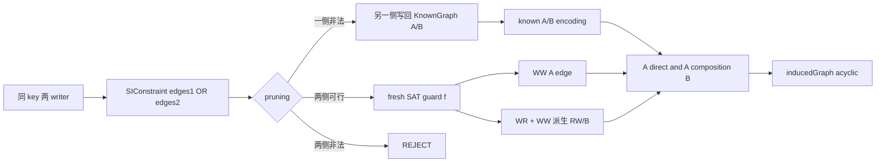
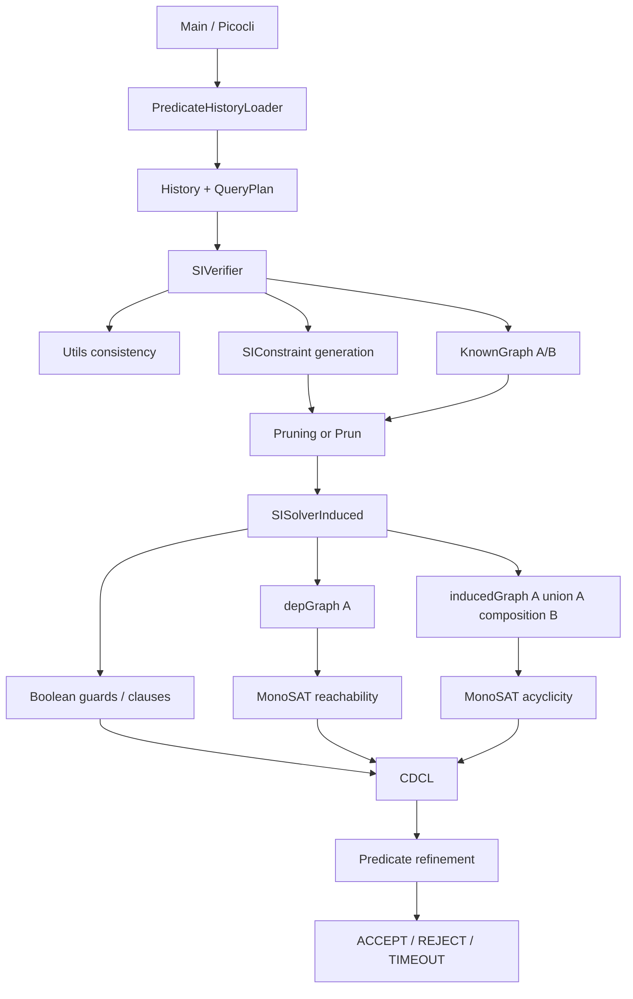
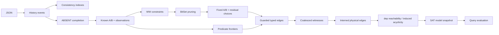
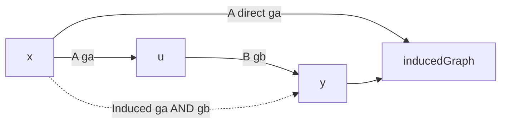
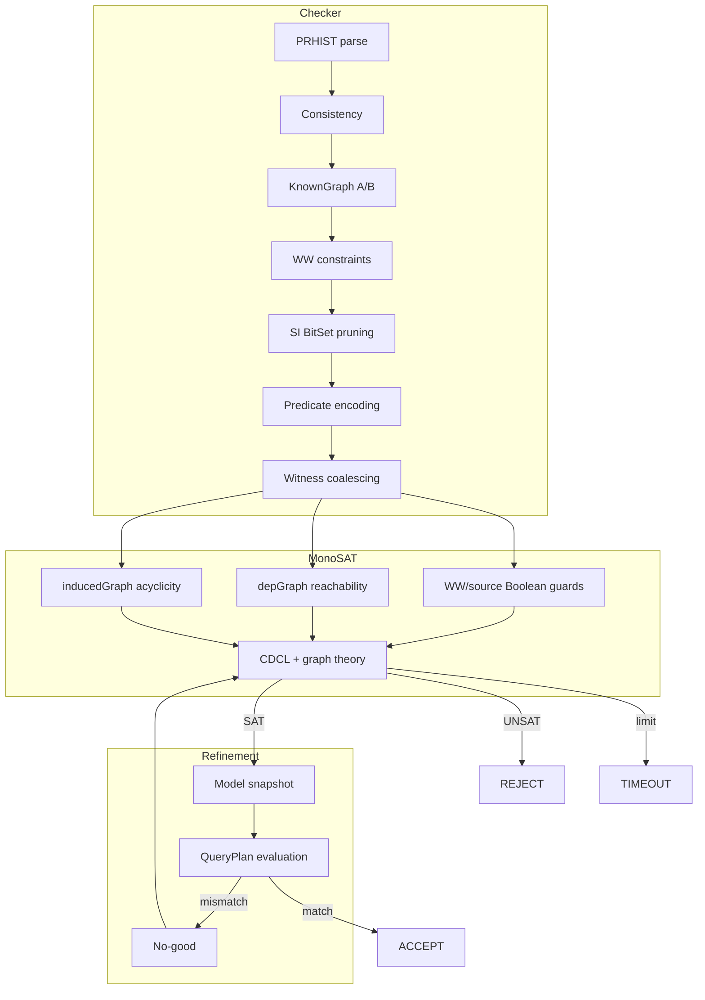

# SI 检测器整体处理流程设计文档

## 1. 文档范围与结论

本文描述 `SI/si-result-detector` 在 2026-09-11 当前工作树中的真实实现。依据是 CLI、loader、history、A/B typed dependency、四种 pruning、`SISolverInduced`、MonoSAT Java/JNI/C++ 接口以及当前测试，而不是从论文或 SER 实现推测不存在的步骤。

结论先行：当前主链为“PRHIST 解析 → 内部一致性门禁 → ABSENT 初始版本补全 → SO/point-WR `KnownGraph` → ordinary WW/RW 二选一 → 可选的 SI-aware pruning → staged MonoSAT encoding → row-local EAGER/general predicate constraints → predicate witness 合并 → 两张物理图的 endpoint edge 复用 → `InducedSI` 无环求解 → general query refinement → ACCEPT/REJECT/TIMEOUT”。

最终公式不是 SER 的 total serialization order，也不是简单的 `A∪B` 无环：

```text
A = SO ∪ WR ∪ WW ∪ PR_WR
B = RW ∪ PR_RW
InducedSI = A ∪ (A ∘ B)

ACCEPT iff
  存在 WW 方向和 predicate frontier assignment，满足：
    1. 全部 Boolean/source/latest-visible 约束；
    2. InducedSI 无环；
    3. general QueryPlan 在该模型 snapshot 上与 recorded result 一致。
```

本次以 SER 的近期实现与两份审计报告为参照，同步了可以保持 SI 语义的通用改进：显式 ABSENT 初始版本、general all-local 门禁、三态超时、predicate witness coalescing、graph-edge interning、residual SAT 统计、BitSet branch oracle。没有移植依赖 serial AR 的 GMWR/WW feedback；直接移植会改变隔离级别。

## 2. 端到端调用顺序

```text
Main.main
  -> Audit.call
     -> PredicateHistoryLoader.loadHistory
     -> build SIVerifier/SolverSettings
     -> SIVerifier.auditResult
        -> Utils.verifyInternalConsistency
        -> new KnownGraph
           -> History.ensureInitialVersions
           -> SO / point-WR / predicate observations
        -> generateConstraintsSI
        -> pruning
           NONE
           or REACHABILITY: InducedGraph.Oracle
           or SNAPSHOT: Prun shared-snapshot
           or PRUN: shared-snapshot + InducedGraph.Oracle
        -> new SISolverInduced
           -> create dep/induced nodes
           -> known A/B edges
           -> residual WW guards
           -> ordinary RW
           -> predicate frontiers and validity clauses
           -> predicate witness coalescing
           -> A/B materialization and A-composition-B edges
           -> seal physical edge supports
           -> assert inducedGraph.acyclic
        -> solveStatus
           -> MonoSAT solveLimited/solve
           -> SAT model query evaluation
           -> mismatch: add no-good and solve again
           -> optional UNSAT conflict extraction
        -> ACCEPT / REJECT / TIMEOUT
```

实现顺序中的重要事实：

1. `SIVerifier` 构造器加载 history；load exception 不会进入 verdict switch。
2. 内部一致性先验证输入中已有 source；缺失的 bottom ABSENT 版本随后在 `KnownGraph` 构造期合成。
3. ordinary WW/RW candidate 在 predicate candidate 之前生成并可被 pruning 固定。
4. predicate dependencies 不是初始图的必然边；主路径在 solver 中按 recorded source 或 frontier guard 生成。
5. general query 的 typed PR edges 在第一次 solve 前已全部 guarded 编码；refinement 只加 Boolean no-good，不临时补图。
6. backend timeout 是独立状态，不能进入 UNSAT conflict extraction。

## 3. 三层表示与两张 MonoSAT 图

### 3.1 三层对象

| 层 | 载体 | 含义 |
| --- | --- | --- |
| History 事实 | `Event`、`PredResult`、`RecordedQueryResult`、session order | 输入实际记录的读、写、query result。 |
| Checker typed logic | `graph.Edge`、`SIEdge`、`SIConstraint`、`PredicateObservation` | 固定依赖、候选依赖及其类型/key witness。 |
| SAT/MonoSAT | WW guard、selection guard、graph edge literal、reachability/acyclicity literal | 控制候选关系并判定模型。 |

`SIEdge` 不是 MonoSAT edge；`Graph.addEdge()` 返回的 literal 也不携带 `EdgeType`。type/key 保留在 Java logical layer，MonoSAT graph 只看到 node endpoints 与控制 literal。

### 3.2 两张图的职责

| 图 | 内容 | theory predicate |
| --- | --- | --- |
| `depGraph` | A edge | `reaches(writer,reader)` 参与 predicate snapshot visibility；不单独 assert acyclic。 |
| `inducedGraph` | A direct edge 与 A∘B composed edge | assert `acyclic()`，直接决定 SI graph 可行性。 |

B edge 本身不直接进入 `inducedGraph`。只有当存在：

```text
A(x,u,ga) AND B(u,y,gb)
```

才创建：

```text
Induced(x,y, ga AND gb)
```

因此 B-only 双向 anti-dependency 不会自动被当成 cycle；这保留 SI 对 write skew 的边界。

## 4. 分阶段设计

### 4.1 PRHIST parse

| 审计项 | 当前实现 |
| --- | --- |
| 输入 | history 目录或 `history.prhist.jsonl`；同目录需要 `initial_state.json`。 |
| 输出 | `History<String,PredicateValue>`。 |
| 核心结构 | Jackson `JsonNode`、`History/Session/Transaction/Event`、`QueryPlan`。 |
| 入口 | `Main.Utils.getLoader()`、`PredicateHistoryLoader.loadHistory()`。 |
| 确定性 | 完全确定；非法结构抛 `InvalidHistoryError`/`Error`。 |
| graph/literal | 不产生。 |
| 复杂度 | 与输入 JSON 节点数线性相关；query AST canonicalization 与 query 大小相关。 |

输入契约：

- 当前 `HistoryType` 只有 PRHIST；
- transaction 只接受 `status=commit`；
- operation 只接受 `w/r/pr`；
- `pr` 使用 `query + result`，旧 `predicate/results` 不在生产 loader 中接受；
- null/array/non-integer number value 被拒绝；
- `write_id/source_write_id/source_txn/source_op_index` 被显式拒绝；
- `initial_state.json` 的 key 必须唯一。

### 4.2 一致性与 normalize

| 审计项 | 当前实现 |
| --- | --- |
| 输入 | loader 生成的 history。 |
| 输出 | 同一 history，或立即 REJECT。 |
| 临时索引 | `(key,value)->List<WriteRef>`、`(txn,key)->write positions`、previous predicate read state。 |
| 入口 | `Utils.verifyInternalConsistency()`。 |
| 信息变化 | 门禁本身不改 history；ABSENT 补全在下一阶段。 |
| graph/literal | 不产生。 |
| 复杂度 | ordinary source 索引约 O(E)；predicate 扫描约 O(PK)，完整 query 取决于 plan。 |

point read 要求：唯一 source；self read 是本 transaction 的最新先前 write；external read 是 source transaction 对 key 的最终 write，且 reader 在该读之前没有 self write。

predicate read 要求：result key 唯一；source 唯一且 committed/in-scope；external source 是 writer final write；internal source 是 read 前最新 self write；recorded inputs 与 `PredResult` 一致。同 identity predicate 的重复读取可以继承未被 self write 改变的 key 分类。

general query 若 scope 内全部有限 key 都由 read 前 self writes 决定，门禁立即执行完整 `QueryPlan`，覆盖 all-INTERNAL JOIN/DISTINCT；否则交 solver 做 model refinement。

### 4.3 ABSENT 初始版本与 KnownGraph

`KnownGraph` 构造器先调用：

```text
History.ensureInitialVersions()
```

有限 required key universe 来自：

- point read/write 的 key；
- predicate result 中实际出现的 key。

bottom 缺失的 required key 获得 `value=null` write。这个 null 是 checker 内部 ABSENT sentinel：

- version ordering 中 bottom 永远早于 real writer；
- predicate row matching 直接把它当作“无贡献”；
- 不送入 `ValueAdapter`，避免把 sentinel 当业务值解析。

KnownGraph 产生：

```text
SO: same session adjacent transaction
WR: unique point-read source writer -> reader
write/source indexes
predicate observations and tuple sources
```

它不在主路径预先生成所有 PR_WR/PR_RW。

### 4.4 PredicateObservation 压缩

对 query scope 中每个 history-known key，KnownGraph 判断：

```text
INTERNAL:
  reader 在本次 predicate event 前写过该 key；
  或 earlier same-identity predicate observation 可继承该 key。

EXTERNAL:
  没有上述本地依据，solver 必须决定 snapshot frontier。
```

保存形式不是完整 map 副本，而是：

```text
predicateKeysById
predicateKeyIds
coveredKeyIds BitSet
defaultPredicateReadType
exceptionKeyIds BitSet
coverageEpoch
```

空间约为 key universe 的 BitSet 加少量例外，而不是每个 observation 的 boxed map entries。

### 4.5 Ordinary WW/RW candidate

对每个 key 的不同 writer transaction pair `(W1,W2)` 建方向选择：

```text
option 1: W1 --WW(k)--> W2
option 2: W2 --WW(k)--> W1
```

若固定 point WR 为：

```text
S --WR(k)--> R
```

且某 branch 选择：

```text
S --WW(k)--> W
```

则该 branch 同时携带：

```text
R --RW(k)--> W
```

默认 coalescing 使相同 writer transaction pair 跨 key 共用一个 direction choice。关闭时产生更细粒度 constraints，但最终 verdict 应保持一致。

### 4.6 REACHABILITY pruning

旧路径对每个 option 复制完整 `KnownGraph`，重新构造 Guava/MatrixGraph。当前路径构造一次：

```text
InducedGraph.Oracle {
  IdentityHashMap<Transaction,int>
  BitSet[] directA
  BitSet[] directB
}
```

每个 option 的检查：

1. clone `directA/directB` rows；
2. 按 type 将 WW 放 A、RW 放 B；
3. 构造 `induced = A ∪ (A∘B)`；
4. 用 Kahn 拓扑检查 `induced`；
5. 两侧都非法则 conflict；只有一侧非法则提交另一侧并更新 oracle/base graph。

设真实 transaction 数为 T。每次 branch 不再付出 history/Guava object 重建成本，矩阵复制空间为 O(T²/word)，composition 与拓扑检查由实际 BitSet density 决定。它是精确替换，不把 B 错当成 A。

### 4.7 SNAPSHOT / PRUN

二者共享 `Prun.java` 的 fixed point：

```text
fixed observations
  -> A predecessors
  -> shared lower bounds per reader
  -> source/competitor writer order
  -> selected SIConstraint branch materialization
```

固定 observation 来源：point `readFrom` 与 external recorded predicate tuple sources；同 `(reader,key)` 多 source 时标为 ambiguous 并不作为 fixed seed。

`IncrementalOrder` 只接受 A edge。对 observation `(R,k,S)` 和 competing writer C：

- 若 C 已在 R 的 shared lower bound 内，则要求 `C <A S`；
- 若 `S <A C`，则 C 必须位于 R 之后，对应的 ordinary anti-dependency仍写入 B，而不是加入 A closure。

SNAPSHOT 只使用这些 snapshot-derived writer directions。PRUN 在每轮开始额外用同一个 SI `InducedGraph.Oracle` 对 residual branch 做双侧可行性消解。

### 4.8 Solver setup、known edges 与 WW

bottom transaction 不创建 MonoSAT node。每个 real transaction 在两张图各创建一个 node。

known A/B edge 和后续 candidate 都经过同一 typed materialization path。每个 residual `SIConstraint` 创建 fresh literal `f`：

```text
edges1 WW guard = f
edges2 WW guard = NOT f
```

`wwOrder[(from,to,key)]` 合并同方向 guard。反向查询可取直接 guard 的否定；known WW 返回常量。找不到受 constraint/known edge 支撑的真实 writer order 时，公式断言 false，而不是创建任意新顺序。

### 4.9 Ordinary RW solver stage

solver 不直接信任 constraint 中重复保存的 RW，而是统一遍历：

```text
readFrom source --WR(k)--> reader
all other final writers W on k
WW(source,W,k) guard
```

生成：

```text
reader --RW(k)--> W
guard = WW(source,W,k)
```

这样 WW 与 RW 在同一 SAT assignment 中同步。

### 4.10 Predicate EAGER

row-local query 的主要公式：

```text
bad writer b:
  NOT Visible(b)
  OR EXISTS good writer g:
       Visible(g) AND WW(b,g,key)
```

recorded source 固定 source 候选，并产生 fixed/guarded PR_WR 与 later-writer PR_RW。INTERNAL key 使用事件位置决定的 self write，不建立跨 transaction PR_WR。

compact row matcher 与 bounded row-contribution cache减少重复 QueryPlan evaluation。ABSENT bottom write直接产生 empty contribution。

### 4.11 General frontier 与 refinement

external candidate 只保留每个 writer transaction 对 key 的 final write。候选可见性：

```text
bottom                         true
same reader txn before event   true
same reader txn after event    false
other real writer              depGraph.reaches(writer,reader)
```

source s 的 latest-visible selection：

```text
Select(s) = Visible(s)
            AND ∧u!=s NOT(Visible(u) AND BeforeWrite(s,u))
```

候选 source 的 typed dependency 在 solve 前注册：

```text
Select(s)                         -> PR_WR(s,reader,key)
Select(s) AND BeforeWrite(s,u)
          AND resultDelta(s,u)    -> PR_RW(reader,u,key)
```

SAT model 后，checker 选择每个 frontier 的 latest-visible write、与 fixed INTERNAL state 合并、执行完整 query。若 recorded result 不匹配，添加否定当前 selection 组合的 clause并重新 solve。

最坏情况下 refinement 可枚举各 key frontier 大小的乘积，因此理论上指数；typed PR dependencies不会在 loop 中重复重建。

## 5. 三种压缩必须区分

| 压缩 | 位置 | 压缩对象 | guard 语义 |
| --- | --- | --- | --- |
| WW constraint coalescing | `SIVerifier.generateConstraintsCoalesce()` | 同 writer pair 跨 key 的 branch choice | 多 key 共用一个 writer方向。 |
| Predicate witness coalescing | `encodePredicateDependencies()` | 相同 `(from,to,type)` 的 PR witness | typed edge guard = OR(witness guards)。 |
| Graph-edge interning | `bindGraphEdge()` | 同一 MonoSAT graph 中相同 `(from,to)` 的 native edge | physical edge support = OR(all logical guards)。 |

第二层仍区分 PR_WR 与 PR_RW，第三层只压缩同一张物理图的 endpoints。`depGraph` 与 `inducedGraph` 不跨图共享 edge literal。

## 6. SI graph-edge support 为何必须双向

SER 的 dependency graph 主要受 acyclicity 约束，单向 `semantic guard -> physical edge` 对 existential SAT 可保持可满足性。SI 不具备这个前提：

```text
depGraph.reaches(writer,reader)
```

本身就是 predicate `Visible(writer)`。若只编码 guard -> edge，solver 可以把没有 semantic guard 支撑的 edge 设为 true，产生虚假的 reachability，并据此选择错误 snapshot。

因此当前 SI interning 在全部 dependency/induced candidate materialize 后执行 sealing：

```text
g1 -> E
g2 -> E
...
E -> (g1 OR g2 OR ...)
```

即：

```text
E <-> OR(g1,g2,...)
```

未开启 interning 时，每个 edge 单独保持 `E <-> g`。这是从 SER 迁移优化时必须保留的 SI-specific correctness 条件。

## 7. 各 relation 的生命周期

| Relation | 固定事实 | candidate/guard | A/B | MonoSAT 影响 |
| --- | --- | --- | --- | --- |
| SO | session 相邻顺序 | 无 choice | A | dep direct、induced direct、predicate reachability。 |
| WR | unique point source | 无 choice | A | 同上；并派生 ordinary RW。 |
| WW | pruning fixed 或 SAT branch | `f` / `NOT f` | A | dep/induced direct；决定 per-key version order。 |
| RW | fixed branch 或 WR+WW 派生 | WW guard | B | 不 direct；与每个 incoming A 组合到 induced。 |
| PR_WR | recorded source 或 selected source | true / Select(s) | A | dep/induced direct；还能改变后续 predicate reachability。 |
| PR_RW | selected source 后 result-changing writer | selection AND WW | B | 只经 A∘B 进入 verdict。 |

## 8. WW branch 的完整生命周期



SAT 选择 branch 后不会把完整模型写回 Java `KnownGraph`。激活发生在 MonoSAT edge literals 中；KnownGraph 只保存 fixed/forced 部分。

## 9. Predicate dependency 的完整生命周期

```mermaid
flowchart LR
    A[PredicateObservation] --> B[INTERNAL / EXTERNAL]
    B -->|INTERNAL| C[self latest write]
    B -->|EXTERNAL| D[KeyFrontier]
    D --> E[selection guards]
    E --> F[PR_WR / PR_RW witnesses]
    F --> G[(from,to,type) coalescing]
    G --> H[A/B guarded dependencies]
    H --> I[depGraph / inducedGraph endpoints]
    I --> J[physical endpoint interning]
    J --> K[edge support sealing]
    K --> L[reachability + acyclicity]
    D --> M[model snapshot]
    M --> N[QueryPlan evaluation]
    N -->|mismatch| O[no-good and re-solve]
```

## 10. Pruning propagation、SAT BCP 与 graph theory

三种推导机制不能混写：

| 机制 | 运行位置 | 输入 | 输出 |
| --- | --- | --- | --- |
| Checker pruning | `Pruning/Prun`，solver 前 | fixed A/B、WW constraints、fixed observations | forced branch 或 conflict。 |
| SAT Boolean propagation | MonoSAT CDCL | `f/not(f)`、AND/OR、support equivalence、blocking clause | literal assignment/conflict。 |
| Graph theory propagation | MonoSAT graph solver | active dep/induced edge literals、reachability、acyclicity | reachability truth、cycle conflict reason。 |

Checker oracle 的 BitSet matrix不会直接传给 MonoSAT；它只决定哪些 constraints 在 solve 前被提交或保留。

## 11. Solve 与 verdict

`solveStatus()` 的状态机：

```text
start deadline at solveStatus()
  -> solveOnce
     timeout -> TIMEOUT
     UNSAT   -> optional conflict extraction -> UNSAT
     SAT     -> evaluate general predicate checks
                all match -> SAT
                mismatch  -> add no-good -> solveOnce again
```

对应上层结果：

| 条件 | `SolveStatus` | `AuditResult` | marker / exit |
| --- | --- | --- | --- |
| consistency/pruning conflict | 不进入 solver | REJECT | `[[[[ REJECT ]]]]` / -1 |
| stable SAT model | SAT | ACCEPT | `[[[[ ACCEPT ]]]]` / 0 |
| formula exhausted | UNSAT | REJECT | `[[[[ REJECT ]]]]` / -1 |
| backend limit | TIMEOUT | TIMEOUT | `[[[[ TIMEOUT ]]]]` / 124 |

deadline 覆盖多轮 solve/refinement，但不覆盖 parse、consistency、pruning、encoding。remaining seconds 使用向上取整，保证配置 1 秒不会在第一次 backend call 前因整数截断变成 0。

旧 `audit()`/`solve()` boolean 包装仍存在以兼容测试与调用方；它们只能回答 accept/non-accept。需要区分 timeout 时必须使用 `auditResult()`/`solveStatus()`。

## 12. UNSAT diagnostics

REJECT 后：

1. 若 known graph 单独 UNSAT，`InducedGraph.extractCycleEdges()`尝试把 induced cycle 还原为 direct A 或 A+B 两段 witness；
2. 否则 `extractConflicts()`对 residual WW constraints 做贪心删除，每次构造不收集嵌套冲突的 solver；
3. 输出 supporting known edges、WW choices、predicate-derived cycle labels；
4. `--dot-output` 可切换 DOT 格式。

TIMEOUT 清空 conflict collections并跳过上述过程，避免把“未完成求解”误报为已证明 UNSAT。

## 13. Statistics 与性能观测

### 13.1 时间

| tag | 内容 |
| --- | --- |
| `SI_VERIFY_INT` | consistency。 |
| `SI_GEN_PREC_GRAPH` | KnownGraph 与 indexes。 |
| `SI_GEN_CONSTRAINTS` | ordinary WW/RW candidates。 |
| `WW_BASELINE_PRUNE_MS` / `SI_PRUNE*` | baseline 总时间及 REACHABILITY 子阶段。 |
| `SI_GRAPH_ENCODE_*` | setup、known、WW、RW、predicate、dependency materialization、acyclic。 |
| `SI_MONOSAT_SOLVE` | 所有 backend solve calls 累计。 |
| `SI_GRAPH_PREDICATE_REFINEMENT` | SAT-model query checks/no-good。 |
| `SI_GRAPH_CONFLICT_EXTRACTION` | UNSAT diagnostic re-solving。 |

### 13.2 数量

主要 counts：

- `WW_INITIAL_CONSTRAINTS/WW_BASELINE_FORCED/WW_AFTER_BASELINE`；
- residual WW choice variables/constraints 与 `solver.nVars()/nClauses()`；
- predicate observations、scoped keys、frontiers/candidates、bad writes；
- dependency witness candidates、typed physical edges、coalesced count；
- depGraph/inducedGraph native physical edge count；
- compact/row-contribution cache hits/misses；
- blocking clauses/literals。

`--solver-stats` 控制详细 predicate counts 与当前 compression/timeout settings 的打印。

## 14. Complexity summary

| 阶段 | 时间 / 空间主项 |
| --- | --- |
| parse/index | 输入大小 O(N)。 |
| consistency | ordinary O(E)；predicate 约 O(PK)，query evaluation另计。 |
| KnownGraph | O(T+E+PK/word)；write/source indexes 与 observations。 |
| WW candidate | O(Σwk² + ΣWRk·wk)。 |
| compact branch check | 每侧 clone O(T²/word)，A∘B 与 topo 取决于 density；无 history/Guava 重建。 |
| shared-snapshot | A closure空间 O(T²/word)，增量 edge 最坏 O(T²/word)。 |
| solver encoding | 与 logical candidates、A/B composable pairs、frontiers相关。 |
| predicate coalescing | candidate 数期望线性 hash grouping。 |
| graph interning | native edges 上界从 logical edge 数降到每图 unique endpoint pair 数。 |
| SAT/refinement | SAT最坏指数；general frontier组合最坏指数。 |

## 15. Implementation notes / remaining boundaries

以下是当前代码边界，不写成已证实 bug：

1. finite key universe 来自 history 中出现的 keys；checker 没有外部 catalog 去枚举完全未出现的关系行。
2. programmatic history 若没有 bottom transaction，`ensureInitialVersions()`不会创建新 session/transaction；PRHIST loader 不受此限制。
3. timeout 从 solve 开始，不是端到端 wall-clock 限制；UNSAT conflict extraction当前使用无 deadline的诊断 solver。
4. SAT 后不会输出完整 WW/source model，也不会把 model-selected edges写回 KnownGraph。
5. predicate witness coalescing 保留 keys，但 native graph edge只保留 endpoints；type/key-sensitive diagnosis仍依赖 Java logical provenance和固定图。
6. `InducedGraph` 中旧 MatrixGraph helpers继续用于 diagnostics与 predicate diagnostic derivation；生产 pruning branch check已改走 BitSet oracle。
7. GMWR/AR total-order propagation未进入 SI。若未来要加入，必须先给出针对 `A ∪ (A∘B)` 的 SI 证明，不能复用 SER 的 serial-order soundness。

## 16. 四张总览图

### 16.1 模块调用图



### 16.2 数据流图



### 16.3 A/B 组合图



### 16.4 最终架构图



## 17. 关键代码索引

| 主题 | 文件 | 入口 |
| --- | --- | --- |
| CLI/result | `src/main/java/Main.java` | `Audit.call()` |
| 三态 verifier | `src/main/java/verifier/SIVerifier.java` | `auditResult()`、`SolverSettings` |
| SAT status | `src/main/java/verifier/SolveStatus.java` | `SAT/UNSAT/TIMEOUT` |
| History completion | `src/main/java/history/History.java` | `ensureInitialVersions()` |
| PRHIST | `src/main/java/history/loaders/PredicateHistoryLoader.java` | `loadHistory()` |
| Consistency | `src/main/java/verifier/Utils.java` | `verifyInternalConsistency()` |
| Fixed graph | `src/main/java/graph/KnownGraph.java` | constructor、`PredicateObservation` |
| WW candidate | `src/main/java/verifier/SIVerifier.java` | `generateConstraintsSI()` |
| Reachability pruning | `src/main/java/verifier/Pruning.java` | `pruneConstraints()` |
| SI branch oracle | `src/main/java/verifier/SIVerifier.java` | `InducedGraph.Oracle` |
| Snapshot/PRUN | `src/main/java/verifier/Prun.java` | `prune/pruneSnapshotOnly()` |
| Solver | `src/main/java/verifier/SISolverInduced.java` | constructor、`solveStatus()` |
| Predicate | 同上 | `encodePredicateConstraints()`、`refinePredicateConstraints()` |
| Compression | 同上 | `encodePredicateDependencies()`、`bindGraphEdge()`、`sealInternedGraphEdges()` |
| Induced formula | 同上 | `addDependencyEdge()`、`addInducedEdge()` |

## 18. 最终回答

当前 SI checker 已不再停留在“每个 pruning branch 复制整图、timeout 被 boolean 吞并、predicate edge逐 witness/native edge膨胀”的早期结构。它吸收了 SER 中与隔离级别无关的输入、求解和压缩改进，同时把关键部分改写为 SI-specific 版本：pruning精确检查 `A ∪ (A∘B)`，B不进入A reachability；物理 edge interning使用完整 support等价，避免虚假 A reachability；最终只对 induced graph断言无环。这个边界保证优化减少 Java构图与MonoSAT物理规模，但不把SI历史按SER total order误拒绝。

