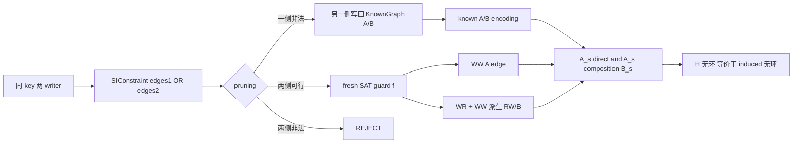
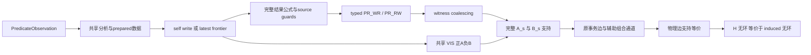
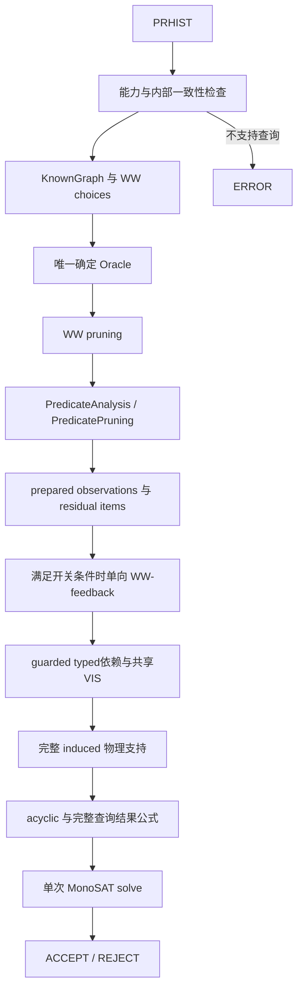

# SI 检测器整体处理流程设计文档

## 1. 文档范围与结论

本文按 2026-09-22 批准的 SI 对齐契约及 2026-09-23 当前实现更新，说明阶段边界、共同快照、guard 与 induced 图的关系。具体测试结果以实施计划和变更记录为准，不由设计说明代替验收。

主链为“PRHIST → 查询能力检查 → 内部一致性 → KnownGraph → WW choices → 唯一确定 Oracle → WW 剪枝 → PredicateAnalysis/PredicatePruning → 可选单向 WW-feedback → residual MonoSAT 编码 → 单次 solve → ACCEPT/REJECT”。不支持的查询通过异常流程得到 ERROR。

公开 `audit HISTORY`，保留 `--[no-]gmwr`、`--[no-]gmwr-prepropagation`、`--[no-]ww-feedback`、`--solver-stats`；WW 剪枝、witness coalescing 和 edge interning 在 CLI 固定开启。没有内部求解超时选项。

```text
A_t = SO ∪ WR ∪ WW ∪ PR_WR
B_t = RW ∪ PR_RW
A_s = A_t ∪ VIS 正分支辅助 A
B_s = B_t ∪ VIS 负分支辅助 B
D = A_s ∪ (A_s ∘ B_s)
最终要求：完整查询结果公式 AND acyclic(D)
```

辅助 VIS 关系不改变报告中的 typed PR_WR/PR_RW 定义。SI 不要求事务串行执行，不能换成 SER 顺序或 `acyclic(A_t∪B_t)`。

## 2. 端到端调用顺序

```text
Main.Audit.call
  -> PredicateHistoryLoader.loadHistory
  -> SIVerifier.auditResult
     -> validateSupportedPredicates
     -> Utils.verifyInternalConsistency
     -> KnownGraph / ensureInitialVersions
     -> generateConstraintsSI（WW/RW）
     -> 构造唯一 SIReachabilityOracle
     -> SIReachabilityPruner（固定完整 WW/RW side）
     -> PredicateAnalysis（只读共享索引/行贡献）
     -> PredicatePruning（准备、确定 PR_WR 固定点、可选 GMWR 预传播）
     -> 单向 WW-feedback（WW-feedback、GMWR、预传播及 WW 剪枝均开启时）
     -> SISolverInduced（消费同一 Oracle 与 prepared/residual 数据）
        SETUP -> KNOWN_EDGES -> WW -> RW -> PREDICATE
        -> DEPENDENCIES -> ACYCLIC
     -> 单次 MonoSAT solve(assumptions)
        SAT -> ACCEPT
        UNSAT -> 读取本次 conflict clause -> REJECT
```

预处理已证明冲突时可在创建 native solver 前返回 REJECT。查询能力错误与语义矛盾分开；非法或不支持的查询不能伪装成 REJECT。

## 3. 三层表示与唯一 MonoSAT 图

### 3.1 三层对象

| 层 | 数据 | 职责 |
| --- | --- | --- |
| 确定事实 | KnownGraph + 单一 SIReachabilityOracle | 保存确定 typed A/B、VIS/NOT_VIS；供全部剪枝阶段共享。 |
| 带 guard 的逻辑关系 | typed dependencies + VIS 辅助 A/B | 表达条件依赖，保留 assumption 和 WW/source guards。 |
| native 图 | `inducedGraph` | 按逻辑支持生成 `D=A_s∪A_s∘B_s`，只对此图断言无环。 |

### 3.2 图与可见性的职责

每个实际消费的外部事务对 `(W,R)` 共享 `v(W,R)`：

```text
v(W,R)       支撑 A_s(W,R)
NOT v(W,R)   支撑 B_s(R,W)
```

正负分支互补属于同一个变量；不同有序对 `v(W,R)` 与 `v(R,W)` 不构成 XOR，允许均 false。只需为实际消费的 pair 创建变量；第 6 节证明其余 pair 可由同一提交拓扑序和各 reader 的 cut 补全。

不再使用独立 A 可达性 native 图作为 VIS。确定 Oracle 未证明 VIS=I*;A 时只表示未知；typed A、普通提交先后与 predicate VIS 不能混为一谈。

## 4. 分阶段设计

### 4.1 PRHIST parse

| 审计项 | 当前实现 |
| --- | --- |
| 输入 | history 目录或 `history.prhist.jsonl`（含 `.zst`）；同目录需要 `initial_state.json`。 |
| 输出 | `History<String,PredicateValue>`。 |
| 核心结构 | Jackson `JsonNode`、`History/Session/Transaction/Event`、`QueryPlan`。 |
| 入口 | `Audit.call()` 直接构造 `PredicateHistoryLoader`，随后调用 `loadHistory()`。 |
| 确定性 | 完全确定；非法结构抛 `InvalidHistoryError`/`Error`。 |
| graph/literal | 不产生。 |
| 复杂度 | 与输入 JSON 节点数线性相关；query AST canonicalization 与 query 大小相关。 |

输入契约：

- audit 输入固定为 PRHIST；
- transaction 必须携带可转换为 long 的整数 `session_seq`，同一 session 内不得重复；loader 在解析操作前按 `session -> session_seq` 排序，JSONL 行序与 `txn` 编号不参与 SO；
- transaction 只接受 `status=commit`；
- operation 只接受 `w/r/pr`；
- `pr` 使用 `query + result`，旧 `predicate/results` 不在生产 loader 中接受；
- null/array/non-integer number value 被拒绝；
- `write_id/source_write_id/source_txn/source_op_index` 被显式拒绝；
- `initial_state.json` 的 key 必须唯一。

### 4.2 一致性与 normalize

| 审计项 | 当前实现 |
| --- | --- |
| 输入 | loader 生成的 history。 |
| 输出 | 同一 history，或立即 REJECT。 |
| 临时索引 | `(key,value)->List<WriteRef>`、`(txn,key)->write positions`、previous predicate read state。 |
| 入口 | `Utils.verifyInternalConsistency()`。 |
| 信息变化 | 门禁本身不改 history；ABSENT 补全在下一阶段。 |
| graph/literal | 不产生。 |
| 复杂度 | ordinary source 索引约 O(E)；predicate 扫描约 O(PK)，完整 query 取决于 plan。 |

point read 要求：唯一 source；self read 是本 transaction 的最新先前 write；external read 是 source transaction 对 key 的最终 write，且 reader 在该读之前没有 self write。

predicate read 要求：result key 唯一；source 唯一且 committed/in-scope；external source 是 writer final write；internal source 是 read 前最新 self write；recorded inputs 与 `PredResult` 一致。仅 row-local predicate 的同 identity 重复读取可以继承未被 self write 改变的 key 分类；JOIN 不通过先前结果继承覆盖。

general query 若 scope 内全部有限 key 都由 read 前 self writes 决定，门禁立即执行完整 `QueryPlan`，覆盖受支持的 all-INTERNAL JOIN；其余情况在首次 solve 前编码完整查询约束。DISTINCT 和不支持的 whole-snapshot 查询先由能力检查报 ERROR。

### 4.3 ABSENT 初始版本与 KnownGraph

`KnownGraph` 构造器先调用：

```text
History.ensureInitialVersions()
```

有限 required key universe 来自：

- point read/write 的 key；
- predicate result 中实际出现的 key。

bottom 缺失的 required key 获得 `value=null` write。这个 null 是 checker 内部 ABSENT sentinel：

- version ordering 中 bottom 永远早于 real writer；
- predicate row matching 直接把它当作“无贡献”；
- 不送入 `ValueAdapter`，避免把 sentinel 当业务值解析。

KnownGraph 产生：

```text
SO: same session adjacent transaction
WR: unique point-read source writer -> reader
write/source indexes
predicate observations and tuple sources
```

它不在主路径预先生成所有 PR_WR/PR_RW。

### 4.4 PredicateObservation 压缩

对 query scope 中每个 history-known key，KnownGraph 判断：

```text
INTERNAL:
  reader 在本次 predicate event 前写过该 key；
  或 row-local 的 earlier same-identity predicate observation 可继承该 key。

EXTERNAL:
  没有上述本地依据，solver 必须决定 snapshot frontier。
```

保存形式不是完整 map 副本，而是：

```text
predicateKeysById
predicateKeyIds
coveredKeyIds BitSet
defaultPredicateReadType
exceptionKeyIds BitSet
coverageEpoch
```

空间约为 key universe 的 BitSet 加少量例外，而不是每个 observation 的 boxed map entries。

### 4.5 Ordinary WW/RW candidate

对每个 key 的不同 writer transaction pair `(W1,W2)` 建方向选择：

```text
option 1: W1 --WW(k)--> W2
option 2: W2 --WW(k)--> W1
```

若固定 point WR 为：

```text
S --WR(k)--> R
```

且某 branch 选择：

```text
S --WW(k)--> W
```

则该 branch 同时携带：

```text
R --RW(k)--> W
```

WW constraint coalescing 固定开启：相同 writer transaction pair 跨 key 共用一个 direction choice，不再保留旧的非合并生成路径。

### 4.6 唯一 Oracle、分析与分阶段剪枝

WW 剪枝、唯一 PR_WR 传播、GMWR preparation/prepropagation 和 solver 共用同一个 `SIReachabilityOracle`。Oracle 只接收证明成立的事实；缺少可见路径不等于 NOT_VIS。`hasWwBranchConflict()` 对生成器的 WW(u,v) 加共同指向 v 的 RW 分支，在原检查上补齐新 WW 与已有 B 的组合成环：检查 B(v) 是否包含 u，或与 u 的 induced 前驱闭包相交。该形状下相对当前确定图的冲突检查完整，无需试加边或复制闭包；通过检查仍不保证与其他未定分支共同可行。非标准分支和谓词来源仍使用原充分检查。

`PredicateAnalysis` 共享 scope 与写索引、latest self、完整外部 final writes、记录验证和行贡献缓存；不创建 SAT 对象、不提交顺序事实。`PredicatePruning` 在 WW 完成后准备 observation/row-key 结果、PR_WR source 候选、GMWR item 和 residual 数据。

每个 GMWR item 保持独立合取：

```text
NOT VIS(bad,R) OR OR_good(WW_k(bad,good) AND VIS(good,R))
```

预传播删除确定不可能的 repair。bad 已可见且只剩一个 repair 时推导相应 WW 与 VIS；无 repair 推导 NOT_VIS，不推导反向 VIS。唯一 PR_WR 进入确定事实固定点；这些确定事实在谓词准备结束后单向反馈给残余 WW 剪枝，整侧提交 WW/RW 并迭代至没有新确定项；不重新运行 GMWR 或冻结数据准备，不把候选 PR guard 当作证明自身的确定事实。关闭 WW-feedback、GMWR、预传播或 WW 剪枝时不执行 feedback，仍准备和编码 residual obligations。

### 4.7 Solver setup、known edges 与 WW

SETUP 只为真实事务创建一个 `inducedGraph` 节点。bottom 在 Java 索引中保留，但其可见性和最早版本顺序以常量表示，不创建 native 节点。

每个 residual `SIConstraint` 创建方向 `f` 与 assumption `a`，两侧分别为 `a∧f` 和 `a∧¬f`。ordinary RW 使用同一 WW guard。固定事实、typed 候选边和 VIS 辅助关系共用支持登记入口；最后按中间事务建立辅助通道，完整表达 `A_s∘B_s`。

observation 的结果公式、source/PR guards 受 `PREDICATE_OBLIGATION` assumption 控制；依赖前置事实裁剪的公式同时带对应事实守卫：来源事实归入 `PREDICATE_OBLIGATION`，GMWR 修复事实归入 `GMWR_RULE`。VIS 变量的正负结构支持属于全局契约，不能依赖首次访问它的 observation assumption。

### 4.9 Ordinary RW solver stage

solver 不直接信任 constraint 中重复保存的 RW，而是统一遍历：

```text
readFrom source --WR(k)--> reader
all other final writers W on k
WW(source,W,k) guard
```

生成：

```text
reader --RW(k)--> W
guard = WW(source,W,k)
```

这样 WW 与 RW 在同一 SAT assignment 中同步。

### 4.10 Predicate EAGER

row-local EAGER 与 GMWR 共用 prepared observation/row-key 数据和完整候选分析。记录本身不匹配时编码矛盾；不通过更宽松路径事后补救。

固定返回来源，以及没有隐式 bottom 备选的唯一实来源，提前走专用路径：在当前 observation/传播 assumption 下断言来源可见，并逐竞争写断言 `¬WW(source,other) ∨ ¬VIS(other,reader)`，不构造通用 latest 合取。JOIN 固定来源保留单候选句柄；全部外部竞争写仍参与检查。

```text
Latest_k(w,R) = Visible(w,R)
  AND 对每个 u≠w、u≠R 且写 k 的外部 final writer:
      NOT(WW_k(w,u) AND Visible(u,R))
```

`LatestVisibleChecker` 只组合公式；SI 提供共享 VIS 与逐 key WW literal。未定来源使用求解器实例内的二元/多元合取缓存，规范化并去重条件后复用公式，不跨 native solver 共享 literal。竞争域必须是完整外部 final writes，不能因 source 候选剪枝而漏掉 later writer。bottom 恒可见且最早，ABSENT 无贡献；query 前最后一次同 key self write 覆盖外部快照，query 后本地写不参与当前读取。

### 4.11 完整查询 frontier 与绑定排除

支持 row-local QueryPlan、声明 row-local 的自定义谓词，以及非 DISTINCT 单调 JOIN QueryPlan。DISTINCT、不支持的 whole-snapshot 自定义谓词走 ERROR。

对支持的 JOIN，求解前为 scope 内所有有限 key 建立 latest-visible frontier，组合完整绑定并核对 bag 重数和 contributing inputs/provenance。额外结果绑定的排除公式也在求解前完成。`result.inputs` 只描述贡献来源，不是完整快照；不能用它代替 scope 内全部 key。多个谓词事件共享同一 reader 的外部 VIS，只叠加各事件之前的 self writes。

所有 selected-source PR_WR、result-changing PR_RW 和结果有效性公式在同一次 solve 前建立。all-INTERNAL 路径仍执行完整 QueryPlan 检查；不存在得到模型后验证快照、追加 no-good、再求解的循环。

## 5. 三种压缩必须区分

| 压缩 | 位置 | 压缩对象 | guard 语义 |
| --- | --- | --- | --- |
| WW constraint coalescing | `SIVerifier.generateConstraintsCoalesce()` | 同 writer pair 跨 key 的 branch choice | 多 key 共用一个 writer方向。 |
| Predicate witness coalescing | `encodePredicateDependencies()` | 相同 `(from,to,type)` 的 PR witness | 保留去重后的 witness guard 集合，各自登记 A/B 支持，不创建合并 OR 链。 |
| Graph-edge interning | `materializeReducedInducedGraph()` | 同一 MonoSAT graph 中相同 `(from,to)` 的 native edge | 辅助图构造后约简无条件图，剩余物理边 support = OR(all logical guards)。 |

逻辑端点支持表使用 `DirectedEdgeKey`：按有向端点值判等，并混合连续节点编号的哈希。避免 `Pair<Integer,Integer>` 的端点异或哈希将大量边集中到少量桶；边合并范围与支持公式不变。

第二层仍区分 PR_WR 与 PR_RW；VIS 辅助支持不伪装成 predicate witness。第三层只在唯一 `inducedGraph` 内压缩 endpoints，并保留全部支持。

## 6. 完整支持、共同快照与证明前提

压缩前每个逻辑 induced edge 的完整支持满足：

```text
D(U,V) <-> A_s(U,V) OR OR_M(A_s(U,M) AND B_s(M,V))
```

SAT 不显式展开 D 的 A/B 笛卡尔积，而构造唯一辅助图 H。对具有 A 入边和 B 出边的事务 V 创建 V*：每个 A(U,V) 支持 a 登记 U→V 和 U→V*，每个 B(U,V) 支持 b 登记 U*→V，两类物理边分别精确受 a、b 控制。没有对应通道时省略辅助节点。节点只表示组合通道，不表示事务开始/提交或额外快照；Oracle 和查询作用域仍只含真实事务。

对任意 guard 赋值，D 的每条 A;B 边展开为 H 中经过一个辅助节点的两段路径；H 的环收缩辅助节点后成为 D 的闭合游走。两个方向均保持有环性，故 acyclic(H) 当且仅当 acyclic(D)。原事务之间的可达关系也一致。物理边的不同副本各有独立 native literal，并分别绑定原始 guard；typed/VIS 的 guard 及 assumption 不变。组合表示至多增加 |T| 个节点、2|A|+|B| 条端点边，不再为每对 A/B 支持创建 AND 字面量。

实现按 H 的端点收集支持，再对含 `Lit.True` 支持的无条件图做传递约简。已有同向确定路径的条件支持无需 native 边；反向确定路径对应每个 guard 的否定约束；其余物理边以直接子句编码每个 `guard→edge` 及 `edge→OR(guards)`，不为蕴含或见证析取额外创建公式变量。谓词断言、来源选择、结果排除和 GMWR residual obligation 也使用直接子句，保留各自 assumption。无条件图若有环直接断言冲突。带 assumption 的事实不作为无条件约简依据。

对任意 guard 赋值，约简保留确定图可达关系，同向冗余边不改变可达性，反向边恰好对应必成环的赋值，其余边保持等价支持，因此压缩前后无环判定等价。逻辑 A/B 和 assumption 元数据完整保留，全部组合由辅助路径表达，压缩只作用于 H 的 native 图，不能提前删除 A/B 支持，也不能将 induced 可达当作 VIS。

四种 typed/aux 组合都不能漏掉；`D(U,U)` 对应支持必须为 false。候选 source 的 VIS guard 不靠其 PR_WR 自我证明：VIS 正负已同时作为全局结构关系参与完整 induced 约束，候选边只随 guard 激活。

对有效 typed A 边 `U→R`，已消费的 `v(U,R)` 必须为 true，否则与辅助 `B_s(R,U)` 组成自环；typed B 边 `R→U` 同理迫使该 VIS 为 false。无需为没有任何消费者的 pair 另建变量或第三张图。

给定满足公式的赋值，对无环 `D` 取提交拓扑序 `c_T=1..n`，定义 reader 的开始 cut：

```text
cut_R = max({c_U | A_s(U,R)} ∪ {0})
```

由于 `A_s⊆D`，有 `cut_R<c_R`。对 `B_s(R,W)`，任意 A_s 前驱 U 都通过 `A_s;B_s` 满足 `c_U<c_W`，所以 `cut_R<c_W`。因此正 VIS 满足 `c_W≤cut_R`，负 VIS 满足 `cut_R<c_W`。将 R 开始事件放在 cut 后、下一次提交前，即得到同一提交序上的事务快照；相同 cut 可按任意顺序安排开始事件。未知 pair 由该快照自然补全。这里的提交拓扑序不表示事务串行执行。

反方向，从合法 committed SI 执行赋予实际 VIS、同 key WW 和实际 latest source：每条 A_s 都是 commit→start，每条 B_s 都是 start→commit，故每条 `A_s;B_s` 沿提交先后方向，D 必无环。SO 和 WW 属于 A_s，分别约束前事务提交早于后事务开始、同 key 写事务不能以冲突快照同时提交。WR/RW 与 latest 共同确定读到的版本。

报告 absent Pred-WR witness **不要求等于实际 latest**。实现选择实际 latest 是存在性对应：SAT→执行时由共同快照选出的 latest 可作合法 witness；执行→SAT 时必须保留这份执行实际 latest 的候选表示。并非任意 good writer 都可替代它，例如 `g1:k=8 → b:k=7 → g2:k=12 → R`，R 查询 `k%4=3` 为空时，选择 latest g2 可解释结果，选择 g1 则会对 b 产生不兼容的 PR_RW。

上述对应以前提为边界：history 为 committed；scope 覆盖所有已知有限 key；支持查询的完整 bag/provenance 正确编码；PR_RW 的 result-changing 判断、所有 guards 与 typed 依赖构造正确；候选剪枝不删除合法执行的实际 latest。图证明不替代对这些实现前提的测试。

两个必要区分：B-only 双向反依赖的 write skew 可合法，不能要求反向 VIS XOR；`W A→X B→C` 只推出提交 `W<C`，不推出 C 开始时已见 W。相反再有 `C A→R` 时，选择 `NOT VIS(W,R)` 会通过辅助 B 产生 induced 环，正确排除跨 key 不一致快照。

## 7. 各 relation 的生命周期

| Relation | 固定事实 | candidate/guard | A/B | MonoSAT 影响 |
| --- | --- | --- | --- | --- |
| SO | session 相邻顺序 | 无 choice | A | A_s direct；约束快照可见。 |
| WR | unique point source | 无 choice | A | A_s direct；并派生 ordinary RW。 |
| WW | pruning fixed 或 SAT branch | assumption AND (`f` / `NOT f`) | A | A_s direct；决定 per-key version order。 |
| RW | fixed branch 或 WR+WW 派生 | WW guard | B | 不 direct；与每个 incoming A_s 组合到 induced。 |
| PR_WR | recorded source 或 selected source | observation assumption AND source guard | A | A_s direct；必须与共享 VIS 一致。 |
| PR_RW | selected source 后 result-changing writer | observation assumption AND selection AND WW | B | 只经 A_s∘B_s 进入 verdict。 |

## 8. WW branch 的完整生命周期



SAT 选择 branch 后不会把完整模型写回 Java `KnownGraph`。激活发生在 MonoSAT edge literals 中；KnownGraph 只保存 fixed/forced 部分。

## 9. Predicate dependency 的完整生命周期



NOT_VIS 来源筛选按 writer→reader 集合索引查询；索引只在 `rememberFact()` 接收 NOT_VIS 时更新，跨 key 共享事务对语义，不遍历全部事实。事实列表仍用于不可变结果和诊断。

## 10. 预传播、SAT BCP 与图理论

| 机制 | 输入 | 输出 |
| --- | --- | --- |
| 共享 Oracle 与剪枝 | 确定 A/B、WW choices、PR_WR 候选、GMWR items | 确定事实、residual 数据或已证明的冲突。 |
| SAT Boolean propagation | residual guards、VIS、AND/OR、完整支持等价 | literal assignment 或 conflict。 |
| Graph theory | active induced edges 和 acyclicity | 无环条件的传播或 cycle conflict reason。 |

Oracle 的 BitSet 状态不能替代最终 SAT，也不能将尚未证明的可见性当成确定事实。

## 11. Solve 与 verdict

```text
编码完成 -> solve(assumptions) 一次
  true  -> SAT   -> ACCEPT
  false -> UNSAT -> 提取本次冲突 -> REJECT
解析/不支持查询/运行异常 -> ERROR
runner 超出外部进程期限 -> PROCESS_TIMEOUT
```

`SolveStatus` 仅 SAT/UNSAT，`AuditResult` 仅 ACCEPT/REJECT；`SatSolveBackend` 返回 boolean。CLI 的 canonical 最终行是 `SI audit result: ACCEPT|REJECT|ERROR`，退出码分别为 0、Java -1（shell 255）、1。

没有检测器内部 deadline。runner 只读取最后非空行的 canonical verdict 并核对退出码；ERROR、异常截断或错配不能归为 REJECT。

## 12. UNSAT diagnostics

直接读取本次 `solve(assumptions)` 的 `getConflictClause()`，将 negated literals 映射到 `A<n>` 和 `WW_CHOICE/PREDICATE_OBLIGATION/GMWR_RULE` 原因。没有 assumption 原因时保留确定图/剪枝冲突摘要，不重建诊断 solver、不重解、不承诺最小 core。

旧 marker 仅在 `--solver-stats` 下输出；异常输出 `[SI] Error` 与最终 ERROR。

## 13. Statistics 与性能观测

阶段口径为内部一致性、KnownGraph/constraints、WW reachability、谓词 build/pruning/reduction、SAT encoding、单次 native solve 与冲突提取。build、pruning、reduction 分开计时，不能将 solver 构造内的嵌套耗时重复当作独立阶段。

编码子阶段保持 SETUP、KNOWN_EDGES、WW、RW、PREDICATE、DEPENDENCIES、ACYCLIC。详细统计包括 PR_WR 初始/残余/强制约束及候选数、GMWR item/residual clauses、唯一 Oracle builds/updates、SAT variables/clauses、MonoSAT propagation/conflicts、VIS 变量与 H 物理边；`SI_PROP_MONOSAT_GRAPH_NODES_COUNT` 包括真实事务和辅助节点，`SI_PROP_MONOSAT_AUXILIARY_NODES_COUNT` 单独记录辅助节点数；既有 `SI_PRED_INDUCED_QUEUED_COUNT`/`DUPLICATES_COUNT` 统计 H 的支持登记与去重，不再表示显式 A;B 配对数、witness 合并和缓存指标。实际发布项与验收数字以 CLI 和变更记录为准。

`WW_AFTER_REACHABILITY` 保留初始 WW 阶段口径；`WW_AFTER_GMWR_FEEDBACK` 表示最终残余 WW，`WW_GMWR_FEEDBACK_FORCED/ROUNDS/MS` 单独记录反馈确定数量、轮次与耗时。GMWR 摘要展示 feedback 前后数量，来源及 GMWR residual 统计仍是反馈前的一次准备结果。`WW_BRANCH_EXTRA_CONFLICTS` 是增强检查额外识别冲突的调用次数，跨轮可能重复，不等于新增固定 WW 数量。

默认输出阶段摘要，`--solver-stats` 输出详细指标。runner 将原始 `*_COUNT` 保存为数值字段，外部进程超时单独记录，不制造内部 TIMEOUT verdict。

## 14. Complexity summary

| 阶段 | 时间 / 空间主项 |
| --- | --- |
| parse/index | 输入大小 O(N)。 |
| consistency | ordinary O(E)；predicate 约 O(PK)，query evaluation另计。 |
| KnownGraph | O(T+E+PK/word)；write/source indexes 与 observations。 |
| WW candidate | O(Σwk² + ΣWRk·wk)。 |
| WW branch check | 原 A 反向可达性与 B 的 direct A 前驱交集检查之外，生成器形状增加 B(v) 与 u 的 induced 前驱闭包求交，不复制闭包；初始 I 闭包构建一次，提交 A/B 支持时按前驱×后继的 BitSet 并集增量更新 I 正反闭包与 VIS=I*;A；GMWR→WW 单向 feedback 复用同一 Oracle 和分支剪枝器，迭代至没有新确定项。 |
| solver encoding | 与来源候选、frontier 公式及 A/B 支持数相关；组合表示按辅助路径构造，端点边上界 2×A边数+B边数，不枚举 A/B 配对；无条件图约简另计。 |
| GMWR preparation / propagation | 每个 key 共享只读末次写列表，排除 reader 自写后保留完整竞争域；仅 absent-key 分类 good/bad。Oracle 按 I/VIS 变化端点通知，bundle 队列去重；显式 NOT_VIS 无路径变化也通知两端。两次交接共享不可变 metadata，动态来源域单独冻结。 |
| predicate coalescing | candidate 数期望线性 hash grouping。 |
| graph interning | native edges 上界从 logical edge 数降到每图 unique endpoint pair 数。 |
| SAT 与完整查询绑定 | SAT 最坏指数；JOIN 绑定枚举可能指数，但不通过多轮 solve 修补模型。 |

## 15. 实施边界

- 输入保持有限 PRHIST，`(key,value)` 唯一解析 source，SO 由 session_seq 决定。
- 只支持批准的 row-local 和非 DISTINCT 单调 QueryPlan；查询能力错误不属于 REJECT。
- 生成器形状的 WW 分支检查对当前确定图完整；非标准分支和谓词来源仍用充分检查。多个分支的相互作用由批量提交及最终 induced 公式检查。
- 实现保留 SI write skew，不复制 SER 串行化约束；不恢复旧 A-reachability 可见性或模型补救路径。
- 设计契约、单测、集成回归和 catalog 实验分别提供不同证据，不能仅凭文档宣称全部验收通过。

## 16. 总览图



## 17. 关键代码索引

| 模块 | 文件 | 接口 / 职责 |
| --- | --- | --- |
| CLI | `src/main/java/Main.java` | `Audit.call()`、canonical verdict 与统计。 |
| 总控 | `src/main/java/verifier/SIVerifier.java` | `auditResult()`、boolean `SatSolveBackend`、分阶段交接。 |
| 状态 | `src/main/java/verifier/SolveStatus.java` | SAT/UNSAT。 |
| 输入 | `src/main/java/history/loaders/PredicateHistoryLoader.java` | `loadHistory()`。 |
| 一致性 | `src/main/java/verifier/Utils.java` | `verifyInternalConsistency()`。 |
| 确定图 | `src/main/java/graph/KnownGraph.java` | `PredicateObservation`、写索引、typed A/B。 |
| 确定事实 | `src/main/java/verifier/SIReachabilityOracle.java` | 唯一共享 Oracle。 |
| WW 剪枝 | `src/main/java/verifier/SIReachabilityPruner.java` | 固定完整候选 side。 |
| 公共分析 | `src/main/java/verifier/PredicateAnalysis.java` | 能力校验、写/source/行贡献。 |
| 谓词准备 | `src/main/java/verifier/PredicatePruning.java` | prepared row-key/observation、PR_WR 固定点、residual items。 |
| GMWR | `src/main/java/verifier/SiGmwrPropagationState.java` | item 预传播与残余状态。 |
| 编码 | `src/main/java/verifier/SISolverInduced.java` | `visibilityLiteral()`、`encodeFactorizedInducedGraph()`、`solveStatus()`。 |
| latest | `src/main/java/verifier/LatestVisibleChecker.java` | 基于 SI VIS/WW 的 latest 公式。 |

## 18. 判定与优化边界

阶段组织可以对齐 SER，语义仍由 SI 的完整 `A_s∪A_s∘B_s` 与共同快照公式决定。共享分析、准备、剪枝和物理边复用均须保持这一契约；具体完成状态与验证结果记录在实施计划和变更记录中。
